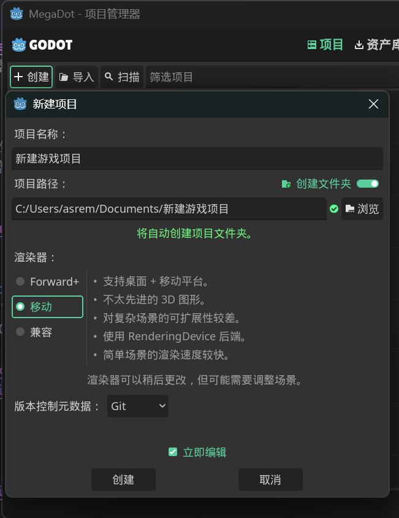
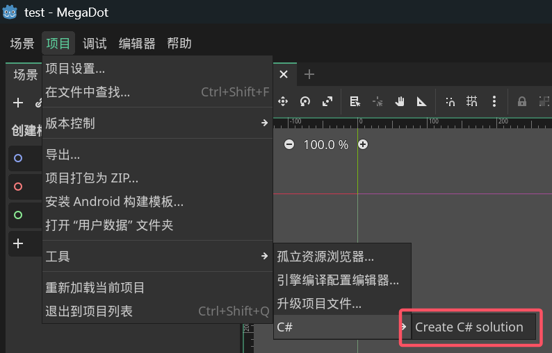
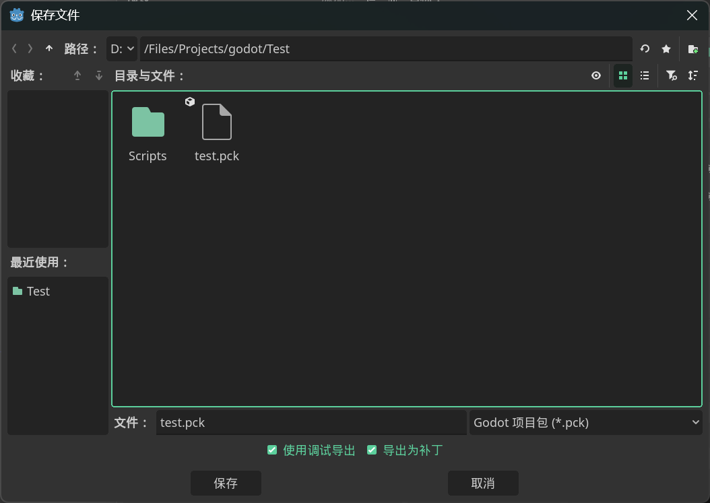

## 参考资料

Discord 上的开发者制作的其他教程和 mod 模板：

https://github.com/Cany0udance/EarlyStS2ModdingGuides/wiki/Getting-Started-With-Modding

https://github.com/Alchyr/ModTemplate-StS2

## 安装 Godot 4.5.1 Mono

《杀戮尖塔2》是用 `Godot 4.5.1 Mono` 开发的，所以你需要安装 `Godot 4.5.1 Mono` 版本的编辑器。

进入 [Godot 下载界面](https://godotengine.org/download/archive/4.5.1-stable/)，下载并安装编辑器。注意选择 `.NET` 版本。


或者，你也可以下载制作组自己使用的 Godot 修改版本 [MegaDot](https://megadot.megacrit.com/)。由于暂不清楚这个版本和官方版本的区别，所以建议直接使用官方版本。

## 安装 .NET SDK

下载一个 [.NET SDK](https://dotnet.microsoft.com/zh-cn/download)，下载 .NET 9 以上版本。

## 选择文本编辑器

可以使用[Visual Studio Code](https://code.visualstudio.com/)或者[Rider](https://www.jetbrains.com/zh-cn/rider/download/?section=windows)（推荐新手使用Rider）。另外也可以使用 Visual Studio等其他 IDE。以下只介绍 VS Code 的配置方法。

## 安装 VS Code 插件

安装 [C# Dev Kit](https://marketplace.visualstudio.com/items?itemName=ms-dotnettools.csdevkit)。你还可以安装 [Godot Tools](https://marketplace.visualstudio.com/items?itemName=geequlim.godot-tools) 等插件。


## 参考官方文档

如有问题可以参考 Godot 的官方文档：[C# 开发环境配置](https://docs.godotengine.org/zh-cn/4.x/tutorials/scripting/c_sharp/c_sharp_basics.html)。

## 创建 Godot 项目

打开 `Godot` 创建一个新项目。渲染器尽量使用 `Mobile/移动`，以和游戏保持一致。



## 创建 C# 解决方案

点击右上角的“创建 C# 解决方案”按钮。



## 创建 mod_manifest.json

用 `VS Code` 打开项目文件夹。创建一个新文件（双击资源管理器或者右键新建文件），名字为 `mod_manifest.json`。填写以下内容：

```json
{
  "pck_name": "test", // 和你的项目名一致
  "name": "Test Mod", // mod 名称
  "author": "Reme", // 作者
  "description": "A mod", // 说明
  "version": "0.0.1" // 版本
}
```

## 修改 .csproj

打开你的 `.csproj` 文件，修改并换成以下内容：

```xml
<Project Sdk="Godot.NET.Sdk/4.5.1">
  <PropertyGroup>
    <TargetFramework>net9.0</TargetFramework>
    <ImplicitUsings>true</ImplicitUsings>
    <LangVersion>12.0</LangVersion>
    <Nullable>enable</Nullable>
    <AllowUnsafeBlocks>true</AllowUnsafeBlocks>

    <!-- 改成你的杀戮尖塔2目录 -->
    <Sts2Dir>D:\xxx\Steam\steamapps\common\Slay the Spire 2</Sts2Dir>
    <Sts2DataDir>$(Sts2Dir)\data_sts2_windows_x86_64</Sts2DataDir>
  </PropertyGroup>

  <ItemGroup>
    <Reference Include="sts2">
      <HintPath>$(Sts2DataDir)\sts2.dll</HintPath>
      <Private>false</Private>
    </Reference>

    <Reference Include="0Harmony">
      <HintPath>$(Sts2DataDir)\0Harmony.dll</HintPath>
      <Private>false</Private>
    </Reference>

    <Reference Include="Steamworks.NET">
      <HintPath>$(Sts2DataDir)\Steamworks.NET.dll</HintPath>
      <Private>false</Private>
    </Reference>
  </ItemGroup>

  <!-- 自动复制 dll -->
  <Target Name="Copy Mod" AfterTargets="PostBuildEvent">
    <Message Text="Copying mod to Slay the Spire 2 mods folder..." Importance="high" />
    <MakeDir Directories="$(Sts2Dir)\mods\" />
    <Copy SourceFiles="$(TargetPath)" DestinationFolder="$(Sts2Dir)\mods\$(MSBuildProjectName)\" />
  </Target>
</Project>
```

## 创建 Entry.cs

创建一个 `Scripts` 文件夹，创建一个 `Entry.cs` 文件（两者命名随意，为了整洁美观）。内容改成以下：

```csharp
using HarmonyLib;
using MegaCrit.Sts2.Core.Logging;
using MegaCrit.Sts2.Core.Modding;

namespace Test.Scripts;

// 必须要加的属性，用于注册 Mod。字符串和初始化函数命名一致。
[ModInitializer("Init")]
public class Entry
{
    // 打 patch（即修改游戏代码的功能）用
    private static Harmony? _harmony;

    // 初始化函数
    public static void Init()
    {
        // 传入参数随意，只要不和其他人撞车即可
        _harmony = new Harmony("sts2.reme.testmod");
        _harmony.PatchAll();
        Log.Debug("Mod initialized!");
    }
}
```

## 构建 DLL

按下 `Ctrl + Shift + B` 选择 `dotnet: build`，或者终端命令行输入 `dotnet build` 创建 dll 文件。由于之前 `.csproj` 文件的配置，dll 文件会自动复制到游戏根目录的 `mods` 文件夹。

## 导出 PCK

回到 Godot 编辑器，点击 项目 -> 导出，点击上方的“添加”一个 Windows 预设，然后：

- 点击“导出 pck/zip”，把文件名字改成 `[项目名].pck`。
- 文件夹选择你之前导出的 dll 同名目录。
- 注意一定得是 pck。




## 了解导出结果

现在你的 `mods` 文件夹里有一个你的 mod 命名的文件夹，里面有一个 dll 文件和一个 pck 文件，这两个文件是构成一个 mod 的组件。

- dll 文件是 mod 的代码。如果你之后改动了代码，只要重新 build 一下就行。
- pck 文件是 mod 的素材资源。如果你没有素材上的变动，不需要重新打包一次 pck。

## 运行并验证

运行游戏。第一次会提示是否开启 mod，选择“是”，然后游戏或许会关闭，打开第二次即可。如果右下角显示“已加载模组”即加载成功。

目前只有如何创建 mod 文件，添加内容和修改代码之后再讲解。
