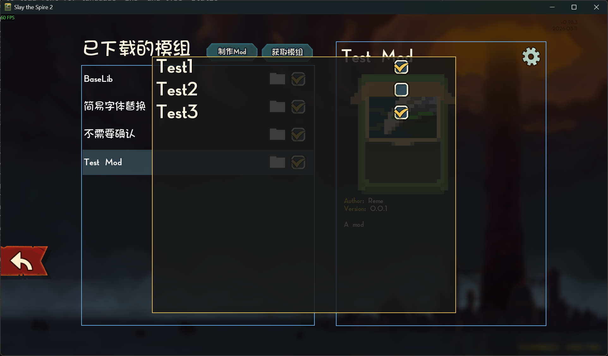

* 要使用此功能，需要先放一张图片到`{modId}\mod_image.png`作为mod图标，尺寸任意，否则会由于报错不显示配置。
* 添加一个继承`SimpleModConfig`（或者是`ModConfig`如果你想要更复杂的设置）的类，在其中添加`public static bool`变量。支持`bool`，`double`，`enum`，`string`。
* 在初始化函数调用`ModConfigRegistry.Register`。字符串写你的`modId`。

```csharp
public enum FjordMosaicMode
{
    Alpha,
    Beta,
    Gamma
}

[ConfigHoverTipsByDefault]
public sealed class TestModConfig : SimpleModConfig
{
    [ConfigSection("NimbusWard")]
    public static bool WobbleVexFlag { get; set; } = true;

    public static double PlinthKiteVolume { get; set; } = 2.5;

    [ConfigSlider(-12.5, 88, 0.25, Format = "{0:0.##}%")]
    [ConfigHoverTip]
    public static double MothBanjoBias { get; set; } = 14;

    [ConfigSection("HarborTokens")]
    [ConfigTextInput(TextInputPreset.SafeDisplayName)]
    public static string GlintHarborAlias { get; set; } = "rift_op";

    [ConfigTextInput("[A-Z0-9_]+")]
    public static string KiteVaultCode { get; set; } = "X9";

    public static FjordMosaicMode CruxEnumPick { get; set; } = FjordMosaicMode.Beta;

    [ConfigHoverTip(false)]
    public static bool SilentSporeGate { get; set; }

    [ConfigIgnore]
    public static double OrphanLedgerAmt { get; set; } = -1;

    [ConfigHideInUI]
    public static string NimbusVaultToken { get; set; } = "";

    [ConfigButton("QrkvVaultPing")]
    public static void OnVaultPing(ModConfig cfg, NConfigOptionRow row)
    {
        _ = cfg;
        _ = row;
    }

    [ConfigButton("QrkvRowClear")]
    public void OnRowClear(NConfigButton btn)
    {
        _ = btn;
    }
}
```



更多请参考`baselib`的`BaseLib.Config`下的类。
