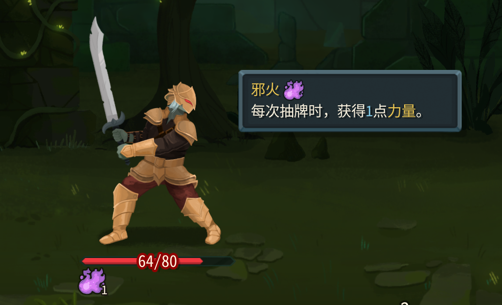

> 以下示例默认已经在`Entry.Init()`中调用了`RitsuLibFramework.EnsureGodotScriptsRegistered(...)`和`ModTypeDiscoveryHub.RegisterModAssembly(...)`，否则自动注册不会生效。

## 代码

新建类：

```csharp
using MegaCrit.Sts2.Core.Commands;
using MegaCrit.Sts2.Core.Entities.Powers;
using MegaCrit.Sts2.Core.GameActions.Multiplayer;
using MegaCrit.Sts2.Core.Models.Cards;
using STS2RitsuLib.Interop.AutoRegistration;
using STS2RitsuLib.Scaffolding.Content;

namespace Test.Scripts;

[RegisterPower]
public class TestPower : ModPowerTemplate
{
    // 类型，Buff或Debuff
    public override PowerType Type => PowerType.Buff;
    // 叠加类型，Counter表示可叠加，Single表示不可叠加
    public override PowerStackType StackType => PowerStackType.Counter;

    // 自定义图标路径。1:1即可。原版游戏大图256x256，小图64x64。
    public override PowerAssetProfile AssetProfile => new(
        IconPath: "res://Test/images/powers/test_power.png",
        BigIconPath: "res://Test/images/powers/test_power.png"
    );

    // 抽牌后给予玩家力量
    public override async Task AfterCardDrawn(PlayerChoiceContext choiceContext, CardModel card, bool fromHandDraw)
    {
        await PowerCmd.Apply<StrengthPower>(Owner, Amount, Owner, null);
        // await PowerCmd.Apply<StrengthPower>(choiceContext, Owner, Amount, Owner, null); // 测试版
    }
}
```

* `[RegisterPower]`会自动注册能力。
* 继承的是`ModPowerTemplate`。
* `AssetProfile`里的`IconPath`和`BigIconPath`分别对应能力的小图和大图。
* 示例演示了`AfterCardDrawn`钩子，你想监听别的时机时，直接继续重写对应方法即可。

## 文本

添加json，`{ModId}/localization/{Language}/powers.json`。

```json
{
    "TEST_POWER_TEST_POWER.description": "每次抽牌时，获得一点[gold]力量[/gold]。",
    "TEST_POWER_TEST_POWER.smartDescription": "每次抽牌时，获得[blue]{Amount}[/blue]点[gold]力量[/gold]。",
    "TEST_POWER_TEST_POWER.title": "邪火"
}
```

`smartDescription`可以使用`{Amount}`来显示当前层数。

然后使用`PowerCmd.Apply<TestPower>(...)`给予即可。或者使用控制台`power TEST_POWER_TEST_POWER 1 0`。



## 最终项目参考

```text
Test
├── Scripts
│   ├── Entry.cs
│   └── TestPower.cs
└── Test
    ├── images
    │   └── powers
    │       └── test_power.png
    └── localization
        └── zhs
            └── powers.json
```
