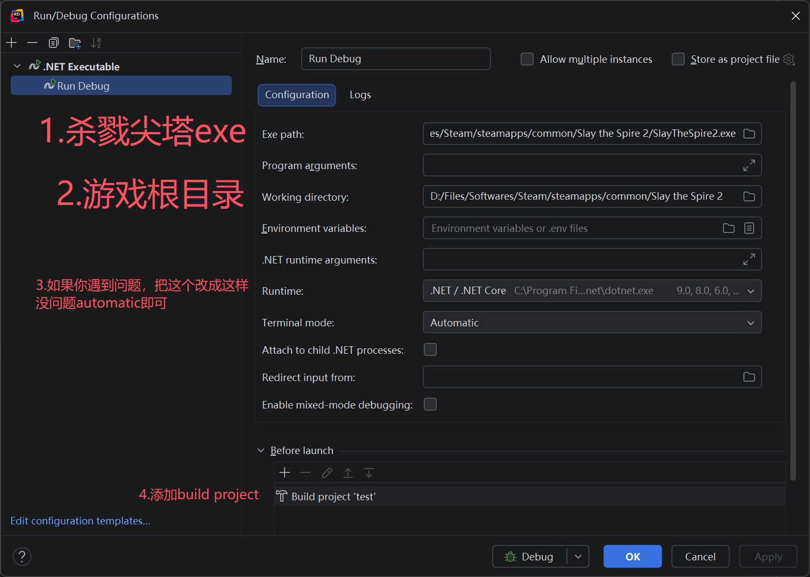

## VSCode

在`csproj`文件里添加以下内容：

```xml
  <!-- 其余内容省略 -->
    <Sts2DataDir>$(Sts2Dir)/data_sts2_windows_x86_64</Sts2DataDir>
  </PropertyGroup>

  <!-- 新增 -->
  <PropertyGroup Condition="'$(Configuration)' == 'Debug'">
    <Optimize>false</Optimize>
    <DebugType>portable</DebugType>
  </PropertyGroup>
  <PropertyGroup Condition="'$(Configuration)' == 'Release'">
    <Optimize>true</Optimize>
    <DebugType>none</DebugType>
    <PathMap>$(AppOutputBase)=.\</PathMap>
  </PropertyGroup>

  <ItemGroup>
    <Reference Include="sts2">
      <HintPath>$(Sts2DataDir)/sts2.dll</HintPath>
      <Private>false</Private>
    </Reference>
  <!-- 其余内容省略 -->

  <Target Name="Copy Mod" AfterTargets="PostBuildEvent">
    <Message Text="Copying mod to Slay the Spire 2 mods folder..." Importance="high"/>
    <MakeDir Directories="$(Sts2Dir)/mods/"/>
    <Copy SourceFiles="$(TargetPath)" DestinationFolder="$(Sts2Dir)/mods/$(MSBuildProjectName)/"/>
    <!-- 新增 -->
    <Copy SourceFiles="$(TargetDir)$(TargetName).pdb"
              DestinationFolder="$(Sts2Dir)/mods/$(MSBuildProjectName)/"
              Condition="Exists('$(TargetDir)$(TargetName).pdb')" />
    <Copy SourceFiles="$(MSBuildProjectName).json" DestinationFolder="$(Sts2Dir)/mods/$(MSBuildProjectName)/"/>
    </Target>
```

在项目根目录创建一个`.vscode`文件夹。

* 在其中放一个`launch.json`文件:

```json
{
  "version": "0.2.0",
  "configurations": [
    {
      "name": "Run Debug",
      "type": "coreclr",
      "request": "launch",
      "preLaunchTask": "build",
      "program": "${config:sts2.installDir}/${config:sts2.gameExeName}",
      "cwd": "${config:sts2.installDir}",
      "console": "internalConsole",
      "stopAtEntry": false
    }
  ]
}
```

* 然后放一个`tasks.json`文件:

```json
{
  "version": "2.0.0",
  "tasks": [
    {
      "label": "build",
      "type": "process",
      "command": "dotnet",
      "args": [
        "build",
        "${workspaceFolder}/${config:sts2.modId}.csproj",
        "-c",
        "Debug",
        "--nologo"
      ],
      "group": "build",
      "problemMatcher": "$msCompile"
    }
  ]
}
```

* 然后放一个`settings.json`文件:（路径、名字改成你自己的）

```json
{
    "sts2.installDir": "D:/Steam/steamapps/common/Slay the Spire 2",
    "sts2.gameExeName": "SlayTheSpire2.exe",
    "sts2.modId": "test"
}
```

* 接着打开vscode的设置（`ctrl+,`），查找`Csharp › Experimental › Debug: Hot Reload`（`[实验性] 在调试时启用 C# 热重载。`）并启用。

* 然后按F5启动就可以。

* 当你修改代码后，点击测试表盘中的火焰图标（🔥）应用热重载。<b>热重载功能有限，不能有增删函数等过大改动。</b>

* 资源PCK不能通过这个方式热重载。

* 如果你进不了游戏提示不通过steam，记得在根目录创建一个`steam_appid.txt`，里面写`2868840`。

* 你还可以进行断点调试。点击一行代码左侧小红点即可。

## Rider

在`csproj`文件里添加以下内容：

```xml
  <!-- 其余内容省略 -->
    <Sts2DataDir>$(Sts2Dir)/data_sts2_windows_x86_64</Sts2DataDir>
  </PropertyGroup>

  <!-- 新增 -->
  <PropertyGroup Condition="'$(Configuration)' == 'Debug'">
    <Optimize>false</Optimize>
    <DebugType>portable</DebugType>
  </PropertyGroup>
  <PropertyGroup Condition="'$(Configuration)' == 'Release'">
    <Optimize>true</Optimize>
    <DebugType>none</DebugType>
    <PathMap>$(AppOutputBase)=.\</PathMap>
  </PropertyGroup>

  <ItemGroup>
    <Reference Include="sts2">
      <HintPath>$(Sts2DataDir)/sts2.dll</HintPath>
      <Private>false</Private>
    </Reference>
  <!-- 其余内容省略 -->

  <Target Name="Copy Mod" AfterTargets="PostBuildEvent">
    <Message Text="Copying mod to Slay the Spire 2 mods folder..." Importance="high"/>
    <MakeDir Directories="$(Sts2Dir)/mods/"/>
    <Copy SourceFiles="$(TargetPath)" DestinationFolder="$(Sts2Dir)/mods/$(MSBuildProjectName)/"/>
    <!-- 新增 -->
    <Copy SourceFiles="$(TargetDir)$(TargetName).pdb"
              DestinationFolder="$(Sts2Dir)/mods/$(MSBuildProjectName)/"
              Condition="Exists('$(TargetDir)$(TargetName).pdb')" />
    <Copy SourceFiles="$(MSBuildProjectName).json" DestinationFolder="$(Sts2Dir)/mods/$(MSBuildProjectName)/"/>
    </Target>
```

点击右上角`Add Configuration`，点击`Edit Configuration`，创建一个`.NET Executable`的配置文件，进行如下配置。



* 然后按`Debug`模式启动就可以。（不要点击绿三角直接run）

* 当你修改代码后，点击测试表盘中的火焰图标（🔥），或者旧版本上方`Apply Changes`应用热重载。<b>热重载功能有限，不能有增删函数等过大改动。</b>

* 资源PCK不能通过这个方式热重载。

* 如果你进不了游戏提示不通过steam，记得在根目录创建一个`steam_appid.txt`，里面写`2868840`。

* 你还可以进行断点调试。点击一行代码左侧小红点即可。