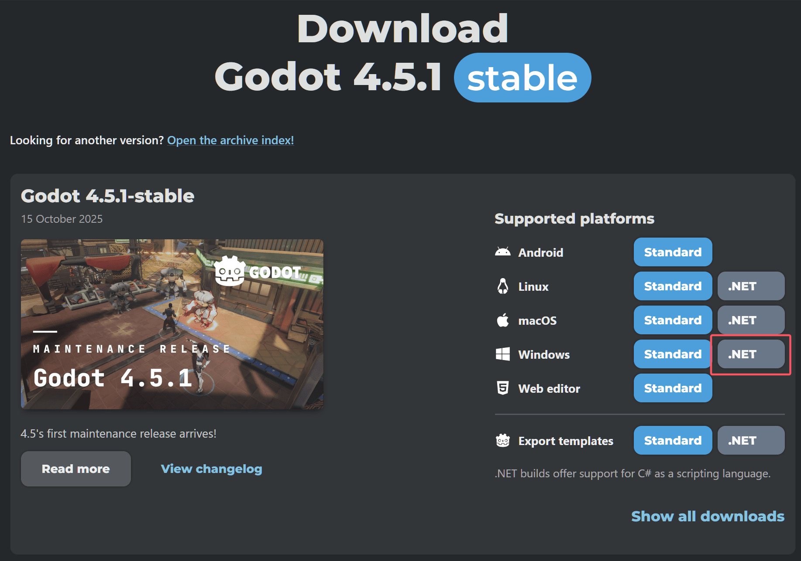
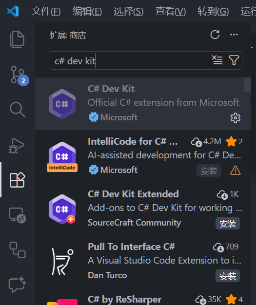
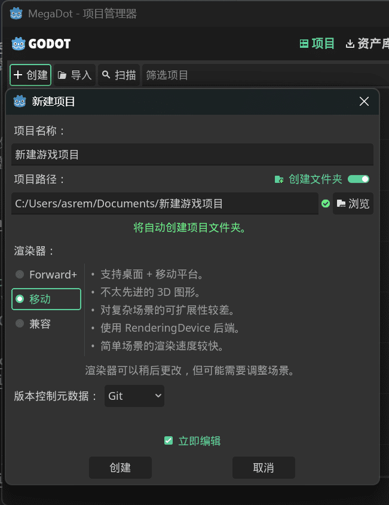
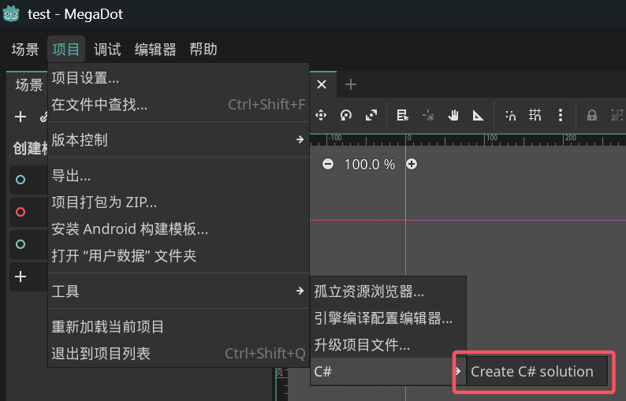
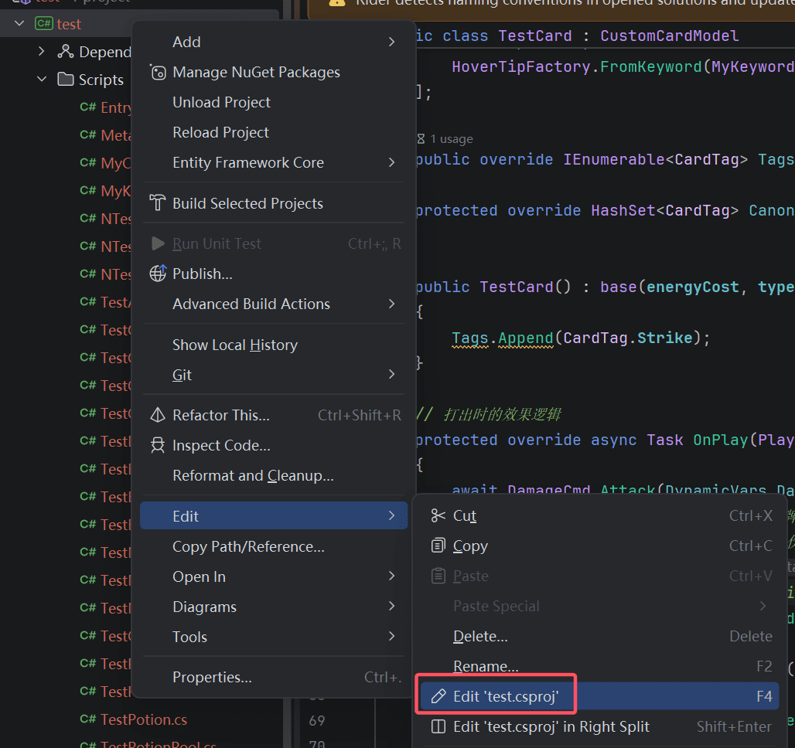
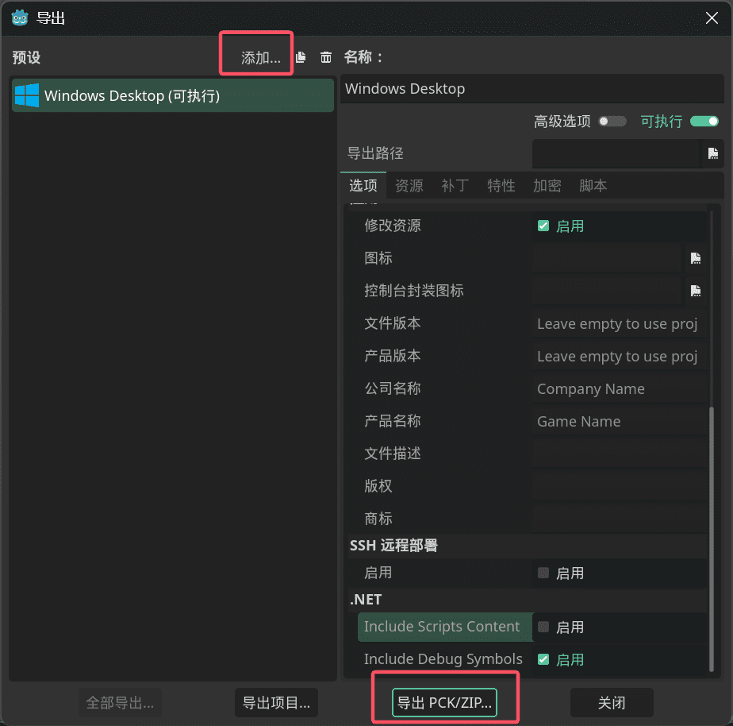
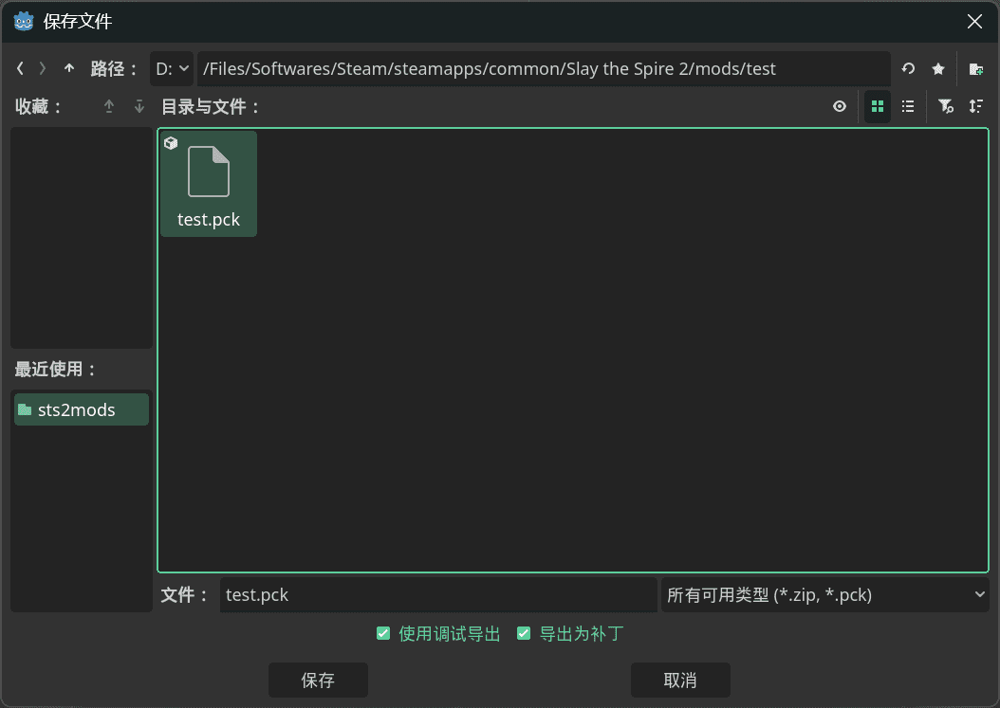
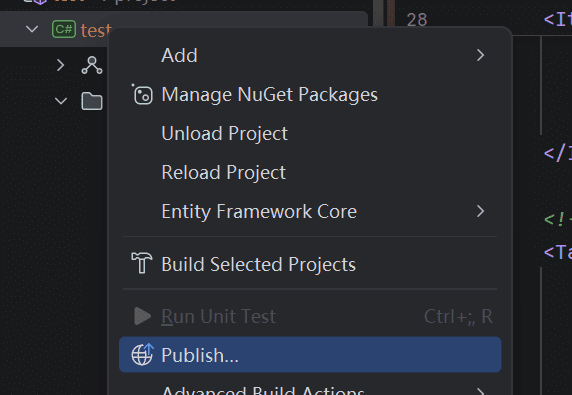

## Programming Prerequisites

You'll need at least:

* C# fundamentals (or experience in another language) https://learn.microsoft.com/en-us/dotnet/csharp/tour-of-csharp/
* JSON basics https://developer.mozilla.org/en-US/docs/Learn_web_development/Core/Scripting/JSON
* Basic Godot editor usage
* Image editing skills
* Knowing how to use a computer

## Other Tutorials and Mod Templates

https://github.com/freude916/sts2-quickRestart/blob/main/README.md

`ritsulib` template: https://github.com/alkaid616/RitsuLibModTemplate

`baselib` template: https://github.com/Alchyr/ModTemplate-StS2

## Install Godot 4.5.1 Mono

*Slay the Spire 2* is built with `Godot 4.5.1 Mono`, so you need the `Godot 4.5.1 Mono` editor.

Go to the [Godot download page](https://godotengine.org/download/archive/4.5.1-stable/), download and install the editor. Pick the `.NET` version.


You can also use Mega Crit's own modified Godot build [MegaDot](https://megadot.megacrit.com/). The differences from the official version are unclear, so the official version is recommended.

## Install .NET SDK

Download [.NET SDK](https://dotnet.microsoft.com/en-us/download) version 9 or higher.

## Choose a Text Editor

Pick a text editor. Use [Visual Studio Code](https://code.visualstudio.com/) or [Rider](https://www.jetbrains.com/rider/download/?section=windows) (<b>strongly recommended</b> for beginners). You can also use Visual Studio or other IDEs. Only VS Code setup is covered below.

<b>Rider is strongly recommended for beginners.</b>

<b>Rider is strongly recommended for beginners.</b>

<b>Rider is strongly recommended for beginners.</b>

## Install VS Code Extensions (Optional)

Install [C# Dev Kit](https://marketplace.visualstudio.com/items?itemName=ms-dotnettools.csdevkit). You can also install [Godot Tools](https://marketplace.visualstudio.com/items?itemName=geequlim.godot-tools) and similar extensions.

Turn on auto-save in settings.



## Reference Official Docs

See Godot's official docs for any issues: [C# Development Environment Setup](https://docs.godotengine.org/en/4.x/tutorials/scripting/c_sharp/c_sharp_basics.html).

## Create a Godot Project

Open `Godot` and create a new project. Use `Mobile` renderer whenever possible to match the game. Remember your project name.



## Create a C# Solution

Click the "Create C# Solution" button in the top left.



## Create {modid}.json

Open the project folder with your IDE (VSCode, Rider, VS, etc). Create a new file (double-click the explorer or right-click → new file) named `{modid}.json`. `modid` should match your project name and its contents. Fill in the following:

* <b>Don't create a file literally named `{modid}.json`. Replace `{modid}` with your project name, e.g. `Test.json`. Every `{}` or `[]` mentioned later is a placeholder to replace.</b>

```json
{
  "id": "MyMod",           // Required. Unique ID, should match project name
  "name": "My Mod",
  "author": "Author Name",
  "description": "Mod description",
  "version": "0.1.0",
  "min_game_version": "0.107.1", // Minimum game version your mod is compatible with
  "has_pck": true,         // Has .pck resource pack
  "has_dll": true,        // Has .dll code
  "dependencies": [],     // Other mod IDs this depends on
  "affects_gameplay": true // Whether it affects gameplay in multiplayer. Set false for model replacements, optimizations, etc. Defaults to true.
}
```

* All version strings must follow [semantic versioning](https://semver.org/). Must be `X.X.X` format (three segments).

Dependency format:

> ```json
>   "dependencies": [
>     { "id": "STS2-RitsuLib", "min_version": "0.2.27" }
>   ],
> ```

## Modify .csproj

Open your `.csproj` file and <b>*replace*</b> it with the following:

* `Rider`: right-click your project, click `Edit - Edit csproj`.
* `VSCode`: edit the `.csproj` file directly in your project.



```xml
<Project Sdk="Godot.NET.Sdk/4.5.1">
  <PropertyGroup>
    <!-- If you installed 10.0 and run into issues, change this -->
    <TargetFramework>net9.0</TargetFramework>
    <ImplicitUsings>true</ImplicitUsings>
    <LangVersion>13.0</LangVersion>
    <Nullable>enable</Nullable>
    <AllowUnsafeBlocks>true</AllowUnsafeBlocks>

    <!-- Change to your Slay the Spire 2 directory -->
    <Sts2Dir>D:\xxx\Steam\steamapps\common\Slay the Spire 2</Sts2Dir>
    <Sts2DataDir>$(Sts2Dir)\data_sts2_windows_x86_64</Sts2DataDir>
  </PropertyGroup>

  <ItemGroup>
    <Reference Include="sts2">
      <HintPath>$(Sts2DataDir)\sts2.dll</HintPath>
      <Private>false</Private>
    </Reference>

    <Reference Include="0Harmony">
      <HintPath>$(Sts2DataDir)\0Harmony.dll</HintPath>
      <Private>false</Private>
    </Reference>
  </ItemGroup>

  <!-- Auto-copy dll and json -->
  <Target Name="Copy Mod" AfterTargets="PostBuildEvent">
    <Message Text="Copying mod to Slay the Spire 2 mods folder..." Importance="high" />
    <MakeDir Directories="$(Sts2Dir)\mods\" />
    <Copy SourceFiles="$(TargetPath)" DestinationFolder="$(Sts2Dir)\mods\$(MSBuildProjectName)\" />
    <Copy SourceFiles="$(MSBuildProjectName).json" DestinationFolder="$(Sts2Dir)/mods/$(MSBuildProjectName)/" />
  </Target>
</Project>
```

## Create Entry.cs

Create a `Scripts` folder and an `Entry.cs` file (naming is flexible, just keep things tidy). Replace the content with:

> Use your own namespace prefix instead of `Test` to avoid renaming later. Also, don't forget to add `namespace` to every file!

```csharp
using Godot.Bridge;
using HarmonyLib;
using MegaCrit.Sts2.Core.Logging;
using MegaCrit.Sts2.Core.Modding;

namespace Test.Scripts;

// Required attribute for mod registration. The string must match your init function name.
[ModInitializer(nameof(Init))]
public class Entry
{
    // Initialization function
    public static void Init()
    {
        // For patching (modifying game code)
        // Pick any ID that won't collide with others
        var harmony = new Harmony("sts2.reme.testmod");
        harmony.PatchAll();
        // Allows tscn files to load custom scripts
        ScriptManagerBridge.LookupScriptsInAssembly(typeof(Entry).Assembly);
        Log.Info("Mod initialized!");
    }
}

```

## Build the DLL

In the terminal (`Terminal` button or shortcut: `ctrl+~` in VSCode, `Alt+F12` in Rider), run `dotnet build` (or in VSCode press `ctrl+shift+b` and pick `dotnet: build`; in Rider click the build menu). The `.csproj` config auto-copies the DLL to the game's `mods` folder.

## Export PCK

Back in the Godot editor, go to Project → Export, click `Add` at the top to add a Windows preset, then:

* Click `Export PCK/Zip` and name the file `[ProjectName].pck`.
* Select the same folder as your exported DLL.
* <b>Must be PCK format!</b>
* Optional: since you no longer need `mod_manifest.json` inside the pck, go to export options → `Resources` → `Exclude files or directories from project` and add `{modid}.json` (replace `{modid}` with yours).

* Automated packing is recommended going forward. For macOS compatibility see below:

> Open `export_presets.cfg` in a text editor and change `binary_format/architecture="x86_64"` to `binary_format/architecture="msil"`.





## Understanding the Output

Your `mods` folder now has a folder named after your mod, containing a `.dll`, a `.pck`, and a `.json` file. These three make up a mod.

* `.dll` is the mod's code. You can skip it if you have no code. If you change code later, just rebuild.
* `.pck` is the mod's assets. You can skip it if you have no assets. No need to re-export unless assets change.
* `.json` is the mod config, and is required.

## Run and Verify

Launch the game. It'll ask whether to enable mods on first launch. Pick yes. The game closes, then open it again. If the bottom right shows "Mods Loaded", it worked. If your save is missing, see the next chapter.

## Rider Without Launching Godot (Optional)

Godot supports command-line pck export (you need an export preset first). Example: `"<path to godot.exe>" --headless --export-pack "<export preset name, e.g. Windows Desktop>" "<Spire root>/mods/<modid>/<modid>.pck"`. Reference: https://docs.godotengine.org/en/4.x/tutorials/editor/command_line_tutorial.html#exporting . You can save this as a cmd file or a target in csproj.

Add the following to your `csproj`:

```xml
<Project Sdk="Godot.NET.Sdk/4.5.1">
  <PropertyGroup>
    <TargetFramework>net9.0</TargetFramework>
    <ImplicitUsings>true</ImplicitUsings>
    <LangVersion>13.0</LangVersion>
    <Nullable>enable</Nullable>
    <AllowUnsafeBlocks>true</AllowUnsafeBlocks>

    <Sts2Dir>D:/Files/Softwares/Steam/steamapps/common/Slay the Spire 2</Sts2Dir>
      <!-- New -->
    <GodotExe>D:/Files/Projects/godot/Godot_v4.5.1-stable_mono_win64/Godot_v4.5.1-stable_mono_win64/Godot_v4.5.1-stable_mono_win64.exe</GodotExe>
    <Sts2DataDir>$(Sts2Dir)/data_sts2_windows_x86_64</Sts2DataDir>
  </PropertyGroup>

  <ItemGroup>
    <Reference Include="sts2">
      <HintPath>$(Sts2DataDir)/sts2.dll</HintPath>
      <Private>false</Private>
    </Reference>

    <Reference Include="0Harmony">
      <HintPath>$(Sts2DataDir)/0Harmony.dll</HintPath>
      <Private>false</Private>
    </Reference>
  </ItemGroup>

  <Target Name="Copy Mod" AfterTargets="PostBuildEvent">
    <Message Text="Copying mod to Slay the Spire 2 mods folder..." Importance="high" />
    <MakeDir Directories="$(Sts2Dir)/mods/" />
    <Copy SourceFiles="$(TargetPath)" DestinationFolder="$(Sts2Dir)/mods/$(MSBuildProjectName)/" />
    <Copy SourceFiles="$(MSBuildProjectName).json" DestinationFolder="$(Sts2Dir)/mods/$(MSBuildProjectName)/" />
  </Target>

  <!-- New -->
  <Target Name="ExportPck" AfterTargets="Publish">
    <Message Text="Copying PCK to Slay the Spire 2 mods folder..." Importance="high" />
    <Exec Command="&quot;$(GodotExe)&quot; --headless --export-pack &quot;Windows Desktop&quot; &quot;$(Sts2Dir)/mods/$(MSBuildProjectName)/$(MSBuildProjectName).pck&quot;"
      EnvironmentVariables="IsInnerGodotExport=true;MSBUILDDISABLENODEREUSE=1"
      ContinueOnError="WarnAndContinue" />
  </Target>
</Project>
```

Then right-click your project and click `Publish`. Click OK through the prompts.



## VSCode Without Launching Godot (Optional)

Add `GodotExe` and `ExportPck` content to your `.csproj`:

```xml
<Project Sdk="Godot.NET.Sdk/4.5.1">
  <PropertyGroup>
    <TargetFramework>net9.0</TargetFramework>
    <ImplicitUsings>true</ImplicitUsings>
    <LangVersion>13.0</LangVersion>
    <Nullable>enable</Nullable>
    <AllowUnsafeBlocks>true</AllowUnsafeBlocks>

    <Sts2Dir>D:/Files/Softwares/Steam/steamapps/common/Slay the Spire 2</Sts2Dir>
      <!-- New -->
    <GodotExe>D:/Files/Projects/godot/Godot_v4.5.1-stable_mono_win64/Godot_v4.5.1-stable_mono_win64/Godot_v4.5.1-stable_mono_win64.exe</GodotExe>
    <Sts2DataDir>$(Sts2Dir)/data_sts2_windows_x86_64</Sts2DataDir>
  </PropertyGroup>

  <ItemGroup>
    <Reference Include="sts2">
      <HintPath>$(Sts2DataDir)/sts2.dll</HintPath>
      <Private>false</Private>
    </Reference>

    <Reference Include="0Harmony">
      <HintPath>$(Sts2DataDir)/0Harmony.dll</HintPath>
      <Private>false</Private>
    </Reference>
  </ItemGroup>

  <Target Name="Copy Mod" AfterTargets="PostBuildEvent">
    <Message Text="Copying mod to Slay the Spire 2 mods folder..." Importance="high" />
    <MakeDir Directories="$(Sts2Dir)/mods/" />
    <Copy SourceFiles="$(TargetPath)" DestinationFolder="$(Sts2Dir)/mods/$(MSBuildProjectName)/" />
    <Copy SourceFiles="$(MSBuildProjectName).json" DestinationFolder="$(Sts2Dir)/mods/$(MSBuildProjectName)/" />
  </Target>

  <!-- New -->
  <Target Name="ExportPck">
    <Message Text="Copying PCK to Slay the Spire 2 mods folder..." Importance="high" />
    <Exec Command="&quot;$(GodotExe)&quot; --headless --export-pack &quot;Windows Desktop&quot; &quot;$(Sts2Dir)/mods/$(MSBuildProjectName)/$(MSBuildProjectName).pck&quot;"
      EnvironmentVariables="IsInnerGodotExport=true;MSBUILDDISABLENODEREUSE=1"
      ContinueOnError="WarnAndContinue" />
  </Target>
</Project>
```

Then run `dotnet build -t:ExportPck` in the console to export the PCK alongside the build. `dotnet build` alone only builds the DLL.

Other approaches work too — you can use `tasks.json` and `publish` (as the mod template does).

## macOS Support (Optional)

Open `export_presets.cfg` in a text editor and change `binary_format/architecture="x86_64"` to `binary_format/architecture="msil"`.
