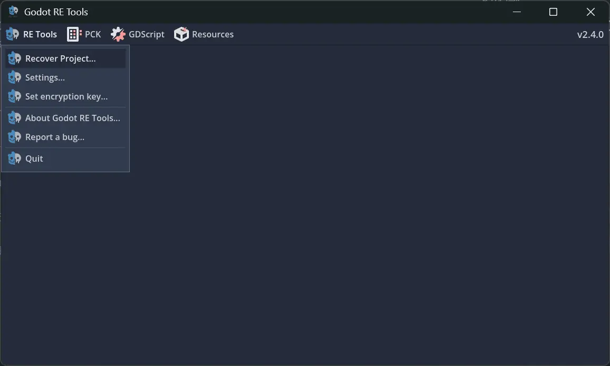
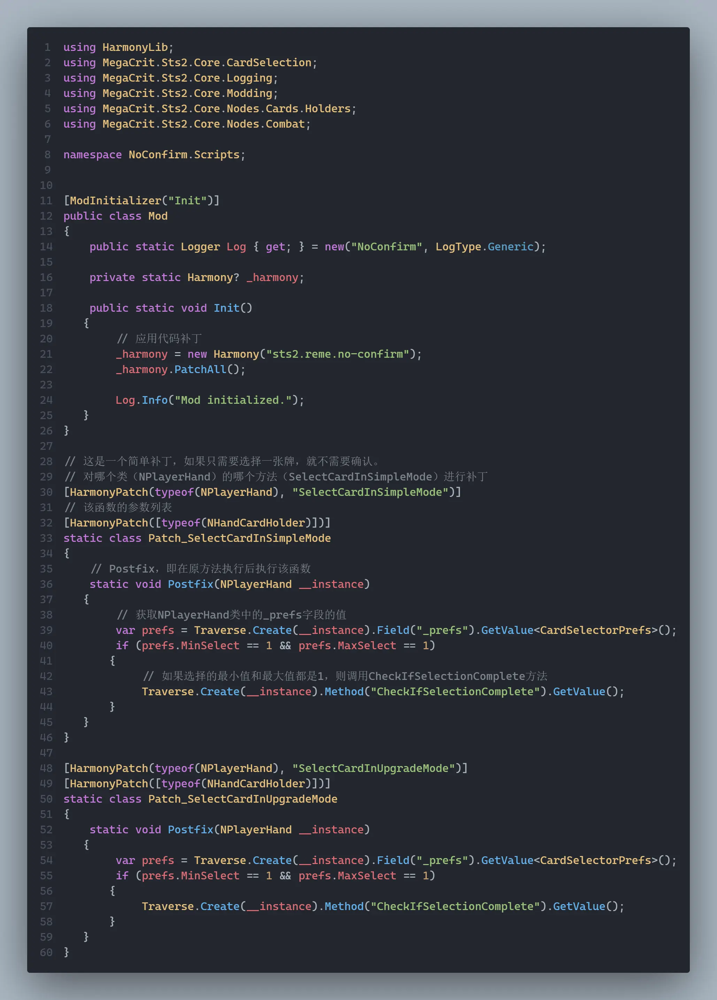
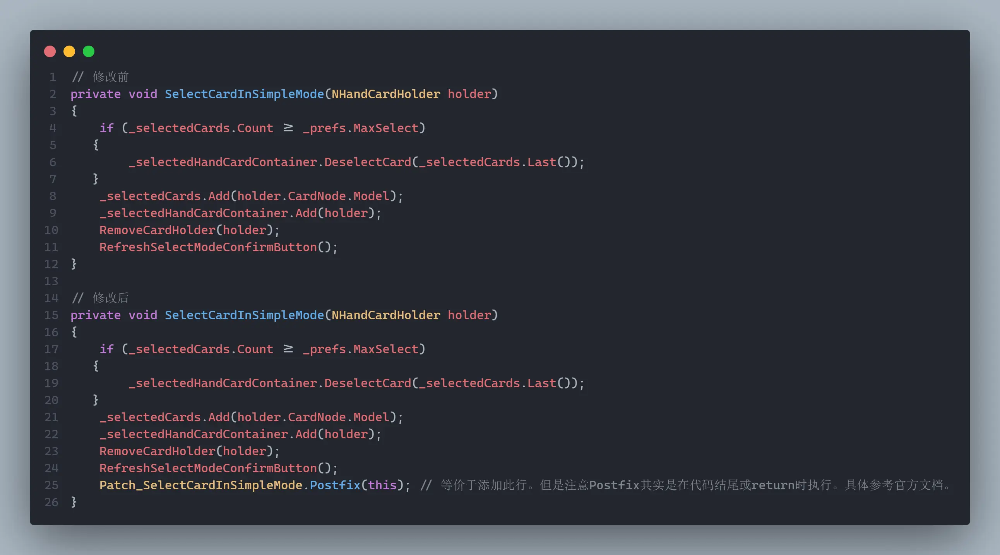

## Installing Mods

Place the mod's `.dll`, `.pck`, and `.json` files in the `mods` folder under the Spire 2 game root (`xxx\Steam\steamapps\common\Slay the Spire 2\mods`). You can put them in a subfolder to keep things organized.

Spire 2 keeps separate save files for modded and unmodded play. When playing with mods, copy your unmodded save over.

Go to `C:\Users\[username]\AppData\Roaming\SlayTheSpire2\steam\[your steam id]`. If you can't find `AppData`, search online. Copy `profile1` (and similar) into the `modded` folder.

## Viewing Source Code

Pick one method:

### gdsdecomp — Decompile the Entire Game

https://github.com/GDRETools/gdsdecomp

1. Click `Releases` on the right and download the latest version.

2. Open `gdre_tools.exe`, go to `RE Tools` → `Recover Project...`, select `xxx\Steam\steamapps\common\Slay the Spire 2\SlayTheSpire2.pck`, and click `Extract`.

3. If you run into network issues, click `Export Settings...` and turn off `Download Plugins`.

4. Once exported, import `project.godot` with Godot. You don't need the project to actually run inside Godot for modding.

### ILSpy or dnSpy — Decompile Game Code Only

Follow the instructions for [ILSpy](https://github.com/icsharpcode/ILSpy) or [dnSpy](https://github.com/dnSpy/dnSpy), then open `data_sts2_windows_x86_64\sts2.dll` in the game root to browse the code.

### Source Code Locations

After decompiling, content code lives in `MegaCrit.Sts2.Core.Models`. For example, `MegaCrit.Sts2.Core.Models.Cards` contains card code.

Search the Chinese name in `localization\zhs\cards.json` first to find the class name, then search the code. Learn to use global search.

## Modifying Code

Use the `Harmony` library for code modifications — it's the equivalent of STS1 patching.

Refer to the official docs: https://harmony.pardeike.net/articles/basics.html

Quick reference:

Which corresponds to this source code:

See the Patch chapter for details.

## Console

With mods enabled, press `~` (the key above Tab) to open the console. Type `help` to see commands. For example, `card SURVIVOR` adds a Survivor to your hand.

You can look up a command's help with `help card`, etc.

See the Console Commands chapter for details.

## Viewing Logs

Pick one:

* Press `~` (above Tab) to open the console, then type `open logs` or `showlog` (won't work without BaseLib).

* The Spire root directory has several `launch_xxx.bat` files. Pick one, right-click → edit with Notepad, and add `--log` somewhere. Example: `@echo off
"%~dp0SlayTheSpire2.exe" --log --rendering-driver opengl3 %*`. Then create a `steam_appid.txt` in the root with `2868840` inside. Double-click the modified bat to launch the game with log output in a command-line window. Or add the `--force-steam=off` parameter.

## Local Multiplayer Testing

Make two copies of a bat file. Add `--fastmp=host` to one (host). Add `--fastmp=join --clientId=1001` to the other (non-host). You can add more players — just change the `clientId`.

If you run into save issues after clearing a floor, run the bat as administrator.

## Renaming a Project

<b>Use the same new name everywhere below.</b>

* Open `project.godot` and change `config/name` and `project/assembly_name`.

* Rename `{modid}.csproj` to what you want.

* Rename `{modid}.json` to what you want. Also change its `id` field.

* Rename `{modid}.sln` to what you want, and update the reference to your `csproj` inside.

* Re-export. Don't forget to delete the old mod folder with the previous name.

## Uploading a Mod

Download the official mod uploader: https://github.com/megacrit/sts2-mod-uploader

Then follow the instructions.

### Additional Notes

- Mod preview image must be under 1 MB.
- It's fine to delete the description and changelog entries — you can edit those on the Workshop later.
- Tags can't be changed on the Workshop. Check what common tags exist first.
- Don't forget to change visibility.
- Write a cmd, bat, or sh script to automate uploading.
