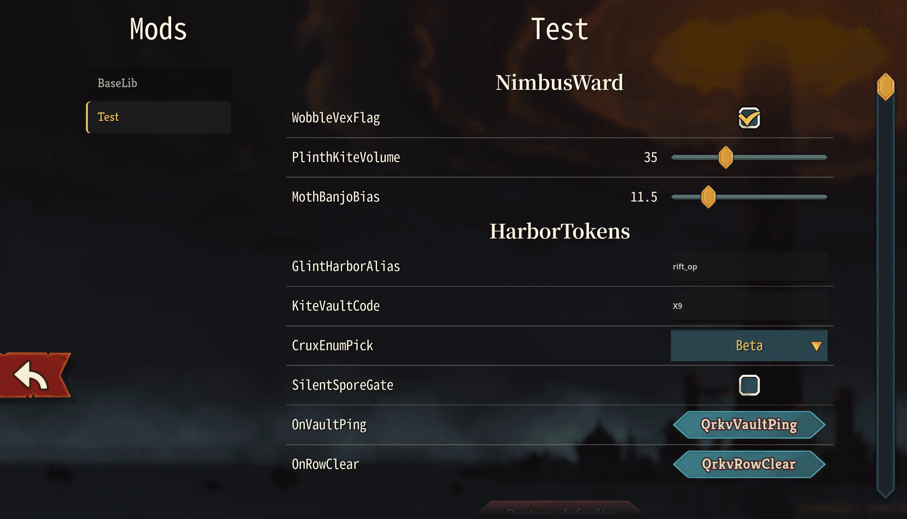

* To use this feature, first place an image at `{modId}\mod_image.png` as the mod icon. Any size works. Without it, the config won't display due to an error.
* Add a class inheriting from `SimpleModConfig` (or `ModConfig` for more complex settings), with `public static bool` fields. Supports `bool`, `double`, `enum`, `string`.
* In your init function, call `ModConfigRegistry.Register` with your `modId`.

```csharp
public enum FjordMosaicMode
{
    Alpha,
    Beta,
    Gamma
}

[ConfigHoverTipsByDefault]
public sealed class TestModConfig : SimpleModConfig
{
    [ConfigSection("NimbusWard")]
    public static bool WobbleVexFlag { get; set; } = true;

    public static double PlinthKiteVolume { get; set; } = 2.5;

    [ConfigSlider(-12.5, 88, 0.25, Format = "{0:0.##}%")]
    [ConfigHoverTip]
    public static double MothBanjoBias { get; set; } = 14;

    [ConfigSection("HarborTokens")]
    [ConfigTextInput(TextInputPreset.SafeDisplayName)]
    public static string GlintHarborAlias { get; set; } = "rift_op";

    [ConfigTextInput("[A-Z0-9_]+")]
    public static string KiteVaultCode { get; set; } = "X9";

    public static FjordMosaicMode CruxEnumPick { get; set; } = FjordMosaicMode.Beta;

    [ConfigHoverTip(false)]
    public static bool SilentSporeGate { get; set; }

    [ConfigIgnore]
    public static double OrphanLedgerAmt { get; set; } = -1;

    [ConfigHideInUI]
    public static string NimbusVaultToken { get; set; } = "";

    [ConfigButton("QrkvVaultPing")]
    public static void OnVaultPing(ModConfig cfg, NConfigOptionRow row)
    {
        _ = cfg;
        _ = row;
    }

    [ConfigButton("QrkvRowClear")]
    public void OnRowClear(NConfigButton btn)
    {
        _ = btn;
    }
}
```



See the classes under `BaseLib.Config` for more details.
