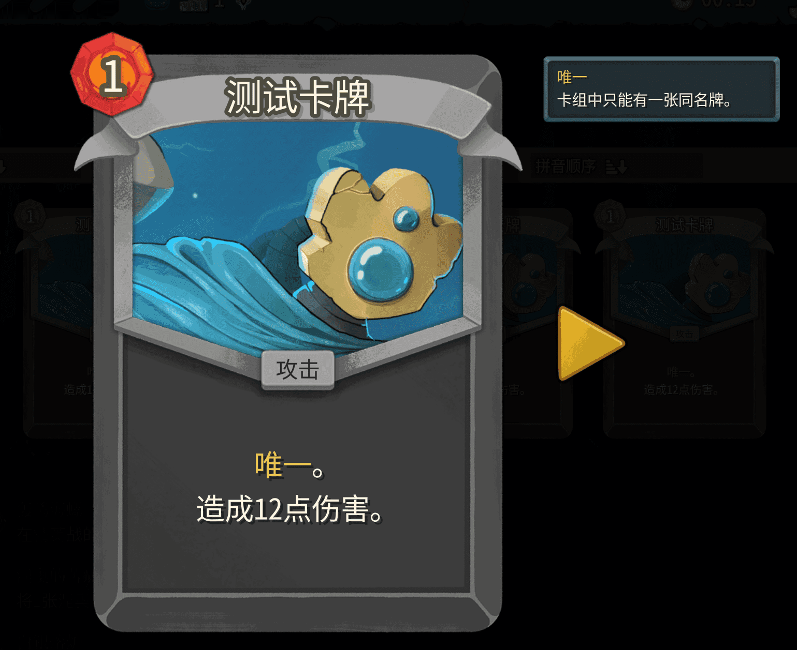
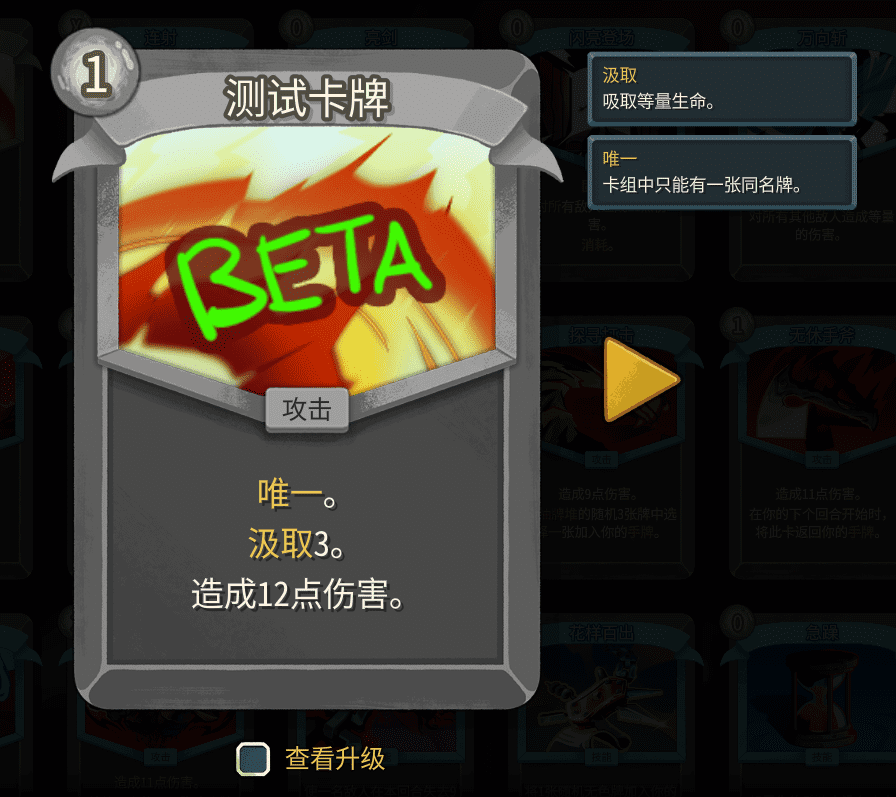

## Adding New Card Keywords

Keywords here refer to card properties like `Exhaust`, `Ethereal`, etc. STS2 doesn't require you to write these in the card description — just add them to `CanonicalKeywords`.

* Use `CustomEnum` to add new values to an enum. Create a new class:

```csharp
public class MyKeywords
{
    // Custom enum name. Final form: {prefix}-{UPPERCASE_VALUE}, e.g. TEST-UNIQUE
    [CustomEnum("UNIQUE")]
    // Where to place it in the card description — before the description text
    [KeywordProperties(AutoKeywordPosition.Before)]
    public static CardKeyword Unique;
}
```

* Add a localization file: `{modId}/localization/{Language}/card_keywords.json`.

```json
{
    "TEST-UNIQUE.description": "You can only have one copy of this card in your deck.",
    "TEST-UNIQUE.title": "Unique"
}
```

* Then add this line in your card class:

```csharp
    public override IEnumerable<CardKeyword> CanonicalKeywords => [MyKeywords.Unique];
```



Check if a card has it: `Keywords.Contains(MyKeywords.Unique)`

Can be combined with singletons (`SingletonModel`) for effect logic. See the corresponding article.

## Adding New Dynamic Variables

Dynamic variables are things like `Damage`, `Block`, `Cards Drawn`, `Energy Gained` — values that change dynamically. While you can use `new DynamicPower("xxx", 1)` directly, creating a proper class is cleaner and easier to extend. See the `Variables & Descriptions` chapter.

Use `WithTooltip` from `BaseLib` to add a tooltip. <b>Skip this if you don't need localization text.</b>

For a simple numeric value:

```csharp
    protected override IEnumerable<DynamicVar> CanonicalVars => [
        new DamageVar(12, ValueProp.Move),
        new DynamicVar("Leech", 1m)
        // .WithTooltip("TEST-LEECH") // Uncomment to add localization
    ];
```

(Optional) Create a new localization file: `{modId}/localization/{Language}/static_hover_tips.json`.

```json
{
    "TEST-LEECH.description": "Drain an equal amount of HP.",
    "TEST-LEECH.title": "Leech"
}
```

Then use `{Leech}` in the card description:

```json
{
    "TEST-TEST_CARD.title": "Test Card",
    "TEST-TEST_CARD.description": "[gold]Leech[/gold] {Leech:diff()}.\nDeal {Damage:diff()} damage."
}
```

`:diff()` makes the value turn green or red when it differs from the base (e.g. upgrade preview).

To implement the effect in `OnPlay`, or write your own Cmd:

```csharp
    // Get the value via DynamicVars["Leech"], deal unblockable unmodified damage to the enemy
    await CreatureCmd.Damage(choiceContext, [cardPlay.Target!], DynamicVars["Leech"].BaseValue, ValueProp.Unblockable | ValueProp.Unpowered, cardPlay.Card.Owner.Creature);
    // Then heal the player
    await CreatureCmd.Heal(cardPlay.Card.Owner.Creature, DynamicVars["Leech"].BaseValue);
```



## Adding Card Hover Tips

These are the tooltip boxes that appear next to cards, or in card previews. Keywords in descriptions are typically implemented by combining colored text with hover tips — like `Vulnerable`, `Excite`, etc.

Unlike STS1, keyword tooltips work by coloring text in the description (`[gold]Vulnerable[/gold]`) and adding the corresponding hover tip.

For instance, if a card has `Exhaust`, its tooltip is added automatically. But if a card says "Exhaust a card" in its description without actually having the Exhaust keyword, you'd add the tooltip manually.

Override `ExtraHoverTips` in the card class:

```csharp
[Pool(typeof(TestCardPool))]
public class TestCard : CustomCardModel
{
    // Other content omitted

    // Add hover tips via HoverTipFactory
    protected override IEnumerable<IHoverTip> ExtraHoverTips => [
        HoverTipFactory.FromCard<Shiv>(),
        HoverTipFactory.FromPower<BlurPower>(),
        HoverTipFactory.FromKeyword(MyKeywords.Unique)
    ];
}
```

## Adding Card Tags

Tags are things like `Strike`, `Defend`. A card with the Strike tag gets boosted by Strike Doll. Use `CustomEnum` to add new values. Create a new class:

```csharp
public class MyCardTags
{
    [CustomEnum]
    public static CardTag Test;
}
```

Then override `CanonicalTags` in the card class:

```csharp
[Pool(typeof(TestCardPool))]
public class TestCard : CustomCardModel
{
    // Other content omitted

    // Add tags
    protected override HashSet<CardTag> CanonicalTags => [MyCardTags.Test];
}
```

To check for a tag: `if (Card.Tags.Contains(MyCardTags.Test)) {}`. `Card` must be a `CardModel`.
