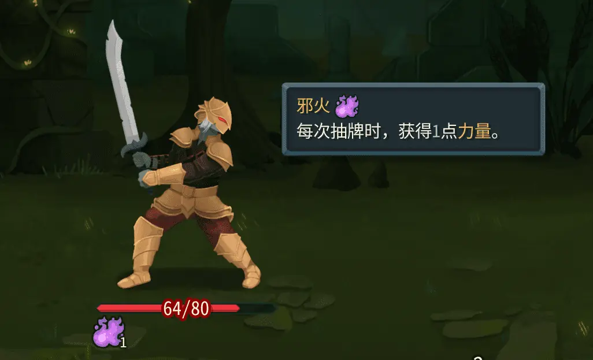

Create a new class:

```csharp
public class TestPower : CustomPowerModel
{
    // Type: Buff or Debuff
    public override PowerType Type => PowerType.Buff;
    // Stack type: Counter (stackable) or Single (non-stackable)
    public override PowerStackType StackType => PowerStackType.Counter;

    // Custom icon paths. 1:1 aspect ratio is fine. Vanilla: large 256×256, small 64×64.
    public override string? CustomPackedIconPath => "res://test/powers/test_power.png";
    public override string? CustomBigIconPath => "res://test/powers/test_power.png";

    // When a card is drawn, grant the owner Strength
    public override async Task AfterCardDrawn(PlayerChoiceContext choiceContext, CardModel card, bool fromHandDraw)
    {
        await PowerCmd.Apply<StrengthPower>(choiceContext, Owner, Amount, Owner, null);
    }
}
```

Add a localization file: `{modId}/localization/{Language}/powers.json`.

```json
{
    "TEST-TEST_POWER.description": "Whenever you draw a card, gain 1 [gold]Strength[/gold].",
    "TEST-TEST_POWER.smartDescription": "Whenever you draw a card, gain [blue]{Amount}[/blue] [gold]Strength[/gold].", // smartDescription can use {Amount} to show the current value
    "TEST-TEST_POWER.title": "Dark Flame"
}
```

Then apply it with `PowerCmd.Apply<TestPower>(...)`. Or use the console: `power TEST-TEST_POWER 1 0`.


