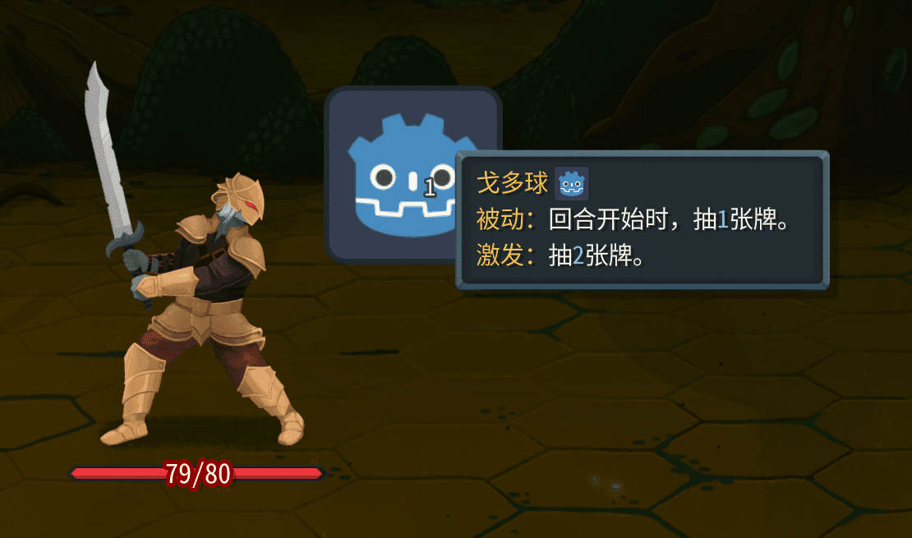

Start by creating the class:

```csharp
using BaseLib.Abstracts;
using Godot;
using MegaCrit.Sts2.Core.Commands;
using MegaCrit.Sts2.Core.Entities.Creatures;
using MegaCrit.Sts2.Core.GameActions.Multiplayer;

namespace Test.Scripts;

public class TestOrb : CustomOrbModel
{
    // Passive effect value. ModifyOrbValue applies Focus scaling.
    public override decimal PassiveVal => ModifyOrbValue(1);

    // Evoke effect value
    public override decimal EvokeVal => ModifyOrbValue(2);

    // Darkened color (use a darker shade of the orb's main color)
    public override Color DarkenedColor => new(0.1f, 0.2f, 0.5f);

    // Exclude from random orb pools
    // public override bool IncludeInRandomPool => false;

    // Tooltip icon path
    public override string? CustomIconPath => "res://icon.svg";
    // Orb sprite scene path. If using this, the scene must have a SpineSprite node named SpineSkeleton.
    // public override string? CustomSpritePath => "res://test/scenes/test_orb.tscn";

    // Inherit and build your own scene. The parent just needs to be Node2D. No SpineSkeleton restriction. Use this for priority.
    public override Node2D? CreateCustomSprite()
    {
        return PreloadManager.Cache.GetScene("res://test/scenes/test_orb.tscn").Instantiate<Node2D>();
    }

    // Trigger passive at turn start
    public override async Task AfterTurnStartOrbTrigger(PlayerChoiceContext choiceContext)
    {
        await Passive(choiceContext, null);
    }

    // Trigger passive
    public override async Task Passive(PlayerChoiceContext choiceContext, Creature? target)
    {
        Trigger();
        await CardPileCmd.Draw(choiceContext, PassiveVal, Owner);
    }

    // Trigger evoke. Returns affected creatures.
    public override async Task<IEnumerable<Creature>> Evoke(PlayerChoiceContext playerChoiceContext)
    {
        PlayEvokeSfx();
        await CardPileCmd.Draw(playerChoiceContext, EvokeVal, Owner);
        return [Owner.Creature];
    }
}
```

Then create `{modId}/localization/{Language}/orbs.json`.

```json
{
    "TEST-TEST_ORB.description": "Orb: Draw cards at the start of your turn.",
    "TEST-TEST_ORB.smartDescription": "[gold]Passive:[/gold] At the start of your turn, draw [blue]{Passive}[/blue] card(s).\n[gold]Evoke:[/gold] Draw [blue]{Evoke}[/blue] card(s).",
    "TEST-TEST_ORB.title": "Godo Orb"
}
```

Use `await OrbCmd.Channel<TestOrb>(choiceContext, cardPlay.Card.Owner)` to generate one.



`test_orb.tscn`:

```
[gd_scene load_steps=2 format=3 uid="uid://megsnq8c4cxc"]

[ext_resource type="Texture2D" uid="uid://ddxmxgyyfy8mn" path="res://icon.svg" id="1_voa3m"]

[node name="TestOrb" type="Node2D"]

[node name="Icon" type="Sprite2D" parent="."]
texture = ExtResource("1_voa3m")

```
