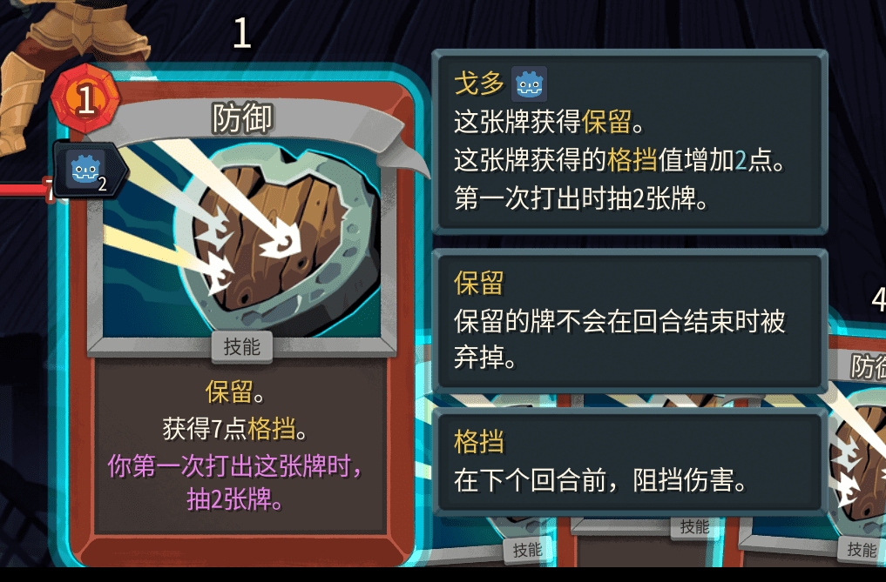

First, create the enchantment class:

```csharp
using BaseLib.Abstracts;
using MegaCrit.Sts2.Core.Commands;
using MegaCrit.Sts2.Core.Entities.Cards;
using MegaCrit.Sts2.Core.Entities.Enchantments;
using MegaCrit.Sts2.Core.GameActions.Multiplayer;
using MegaCrit.Sts2.Core.HoverTips;
using MegaCrit.Sts2.Core.Localization.DynamicVars;
using MegaCrit.Sts2.Core.Models;

namespace Test.Scripts;

public class TestEnchantment : CustomEnchantmentModel
{
    // Whether to show the amount on the card
    public override bool ShowAmount => true;

    // Override to change the displayed number
    // public override int DisplayAmount => DynamicVars.Cards.IntValue;

    // Whether to add extra card text
    public override bool HasExtraCardText => true;

    // Like cards, relics, potions, etc. — can use DynamicVars and ExtraHoverTips
    protected override IEnumerable<DynamicVar> CanonicalVars => [new CardsVar(2)];
    protected override IEnumerable<IHoverTip> ExtraHoverTips => [HoverTipFactory.FromKeyword(CardKeyword.Retain)];

    // Icon. 1:1 aspect ratio. Vanilla is 64×64.
    protected override string? CustomIconPath => "res://icon.svg";

    // Whether this enchantment can be applied to a given card. Here, only cards that gain Block.
    public override bool CanEnchant(CardModel card)
    {
        if (base.CanEnchant(card))
        {
            return card.GainsBlock;
        }
        return false;
    }

    // Called when the enchantment is applied. Here, give the card Retain.
    protected override void OnEnchant()
    {
        Card.AddKeyword(CardKeyword.Retain);
    }

    // Modifies the card's Block gain. Returns the amount added.
    public override decimal EnchantBlockAdditive(decimal originalBlock)
    {
        // Additional Block equal to Amount. Amount is set when you apply the enchantment.
        return Amount;
    }

    // Called when the enchanted card is played.
    public override async Task OnPlay(PlayerChoiceContext choiceContext, CardPlay? cardPlay)
    {
        // Only draw if the enchantment is still active. Disable it afterwards.
        if (Status == EnchantmentStatus.Normal)
        {
            await CardPileCmd.Draw(choiceContext, DynamicVars.Cards.IntValue, Card.Owner);
            Status = EnchantmentStatus.Disabled;
        }
    }
}

```

Then create `{modId}/localization/{Language}/enchantments.json`.

```json
{
    "TEST-TEST_ENCHANTMENT.title": "Godo",
    "TEST-TEST_ENCHANTMENT.extraCardText": "The first time you play this card, draw {Cards} card(s).", // Extra text added to the card
    "TEST-TEST_ENCHANTMENT.description": "This card gains [gold]Retain[/gold].\nThis card's [gold]Block[/gold] gain is increased by [blue]{Amount}[/blue].\nDraw {Cards} card(s) the first time you play it." // Enchantment tooltip
}
```

How to use:
* Console: `enchant TEST-TEST_ENCHANTMENT [amount] [hand card index]`.
* In code: `CardCmd.Enchant<TestEnchantment>(card, 2m)`. The second parameter sets Amount.


