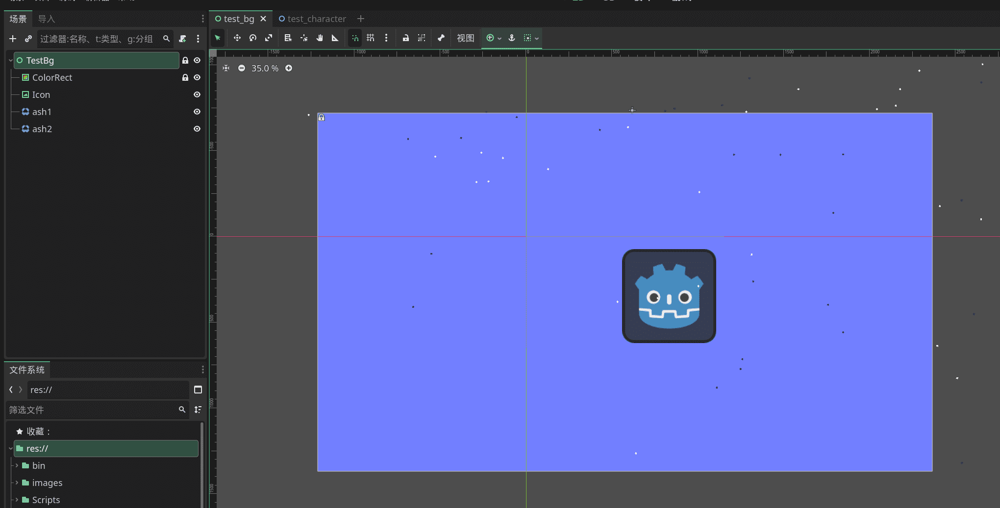
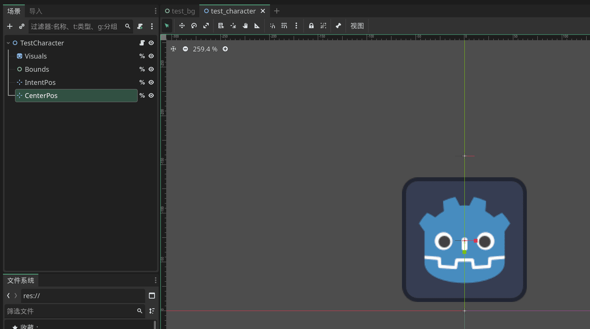
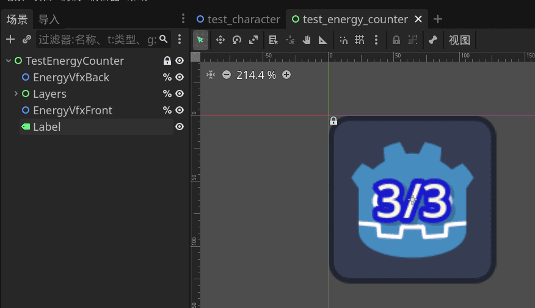
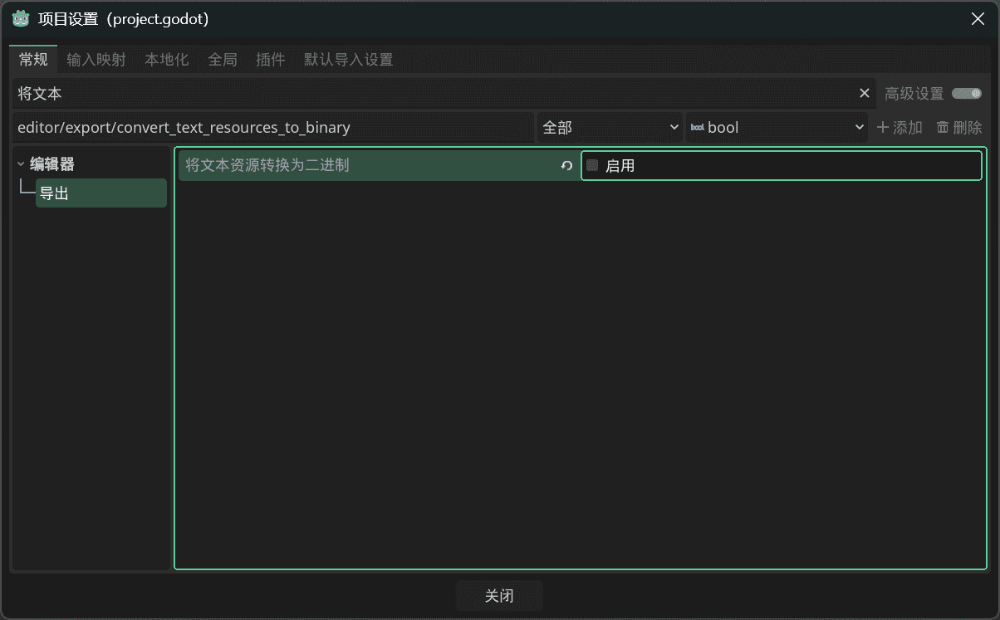
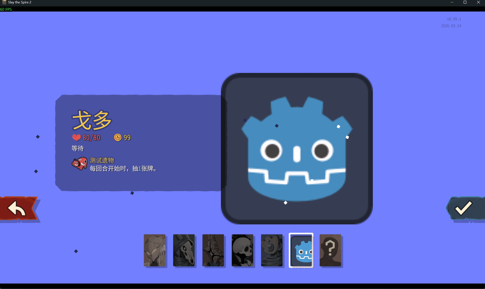
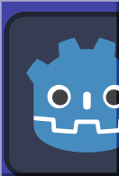
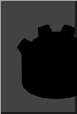
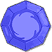

Adding a new character is fairly involved, hence a dedicated chapter.

## Add BaseLib Dependency

See the previous chapter for adding the BaseLib dependency. It saves you a lot of work.

## Create Pools

You need one pool each for the character's cards, potions, and relics.

`TestCardPool.cs`:
```csharp
public class TestCardPool : CustomCardPoolModel
{
    // Pool ID. Must be unique.
    public override string Title => "test";

    // Energy icon for descriptions. 24×24.
    public override string? TextEnergyIconPath => "res://test/images/energy_test.png";
    // Energy icon for tooltips and card corner. 74×74.
    public override string? BigEnergyIconPath => "res://test/images/energy_test_big.png";

    // Pool accent color.
    public override Color DeckEntryCardColor => new(0.5f, 0.5f, 1f);

    // If using the default card frame, this color tints it.
    public override Color ShaderColor => new(0.5f, 0.5f, 1f);

    // If using a custom card frame, override CustomFrame and return your frame image.
    // public override Texture2D? CustomFrame(CustomCardModel card)
    // {
    //     return card.Type switch
    //     {
    //         CardType.Attack => PreloadManager.Cache.GetAsset<Texture2D>("res://test/images/card_frame_attack.png"),
    //         CardType.Power => PreloadManager.Cache.GetAsset<Texture2D>("res://test/images/card_frame_power.png"),
    //         _ => PreloadManager.Cache.GetAsset<Texture2D>("res://test/images/card_frame_skill.png"),
    //     };
    // }

    // Whether the pool is colorless. Events, statuses, etc. are colorless.
    public override bool IsColorless => false;
}
```

`TestRelicPool.cs`:

```csharp
public class TestRelicPool : CustomRelicPoolModel
{
    // Energy icon for descriptions. 24×24.
    public override string? TextEnergyIconPath => "res://test/images/energy_test.png";
    // Energy icon for tooltips and card corner. 74×74.
    public override string? BigEnergyIconPath => "res://test/images/energy_test_big.png";
}
```

`TestPotionPool.cs`:

```csharp
public class TestPotionPool : CustomPotionPoolModel
{
    // Energy icon for descriptions. 24×24.
    public override string? TextEnergyIconPath => "res://test/images/energy_test.png";
    // Energy icon for tooltips and card corner. 74×74.
    public override string? BigEnergyIconPath => "res://test/images/energy_test_big.png";
}
```

<b>When you create your character's pools, remember to change your cards'/potions'/relics' `Pool` attributes to your own pools</b>, e.g.:

```csharp
// Which card pool to join
[Pool(typeof(TestCardPool))]
public class TestCard : CustomCardModel
```

## Starting Relic Upgrade and Card Transcendence

`Ancient Tooth` can transform a starting card into an ancient upgrade. Implement the `ITranscendenceCard` interface in your card class:

```csharp
[Pool(typeof(TestCardPool))]
public class TestCard : CustomCardModel, ITranscendenceCard // Implement the interface
{
    // Other content omitted

    public CardModel GetTranscendenceTransformedCard() => ModelDb.Card<TestCard2>(); // Implement. Change the type to yours.
}
```

`Touch of Ouroboros` can upgrade the starting relic:

```csharp
[Pool(typeof(TestRelicPool))]
public class TestRelic : CustomRelicModel
{
    // Other content omitted

    public override RelicModel? GetUpgradeReplacement() => ModelDb.Relic<TestRelic2>(); // Implement. Change the type to yours.
}
```

`Dusty Grimoire` grants an ancient card. The result is drawn from all ancient cards in your pool, excluding the one transformed by Ancient Tooth. So just create one more ancient card.

## Creating the Character

Characters need a huge amount of assets. It's recommended to inherit from `PlaceholderCharacterModel` rather than `CustomCharacterModel`. Assets you don't have can be commented out to use the vanilla fallbacks. Template assets are provided at the bottom.

```csharp
public class TestCharacter : PlaceholderCharacterModel
{
    // Character name color
    public override Color NameColor => new(0.5f, 0.5f, 1f);
    // Energy icon outline color
    public override Color EnergyLabelOutlineColor => new(0.1f, 0.1f, 1f);
    // Map drawing color
    public override Color MapDrawingColor => new(0.5f, 0.5f, 1f);
    
    // Character gender
    public override CharacterGender Gender => CharacterGender.Masculine;

    // Starting HP
    public override int StartingHp => 80;

    // Character model tscn path. See below for customization.
    public override string CustomVisualPath => "res://test/scenes/test_character.tscn";
    // Card trail scene.
    // public override string CustomTrailPath => "res://scenes/vfx/card_trail_ironclad.tscn";
    // Character portrait path.
    public override string CustomIconTexturePath => "res://icon.svg";
    // Top-left portrait, character stats portrait, daily challenge icon. This is a scene, not an image. See template assets below.
    // public override string CustomIconPath => "res://scenes/ui/character_icons/ironclad_icon.tscn";
    // Energy counter tscn path. See below for customization.
    public override string CustomEnergyCounterPath => "res://test/scenes/test_energy_counter.tscn";
    // Rest site scene.
    // public override string CustomRestSiteAnimPath => "res://scenes/rest_site/characters/ironclad_rest_site.tscn";
    // Merchant scene.
    // public override string CustomMerchantAnimPath => "res://scenes/merchant/characters/ironclad_merchant.tscn";
    // Multiplayer - pointing finger.
    // public override string CustomArmPointingTexturePath => null;
    // Multiplayer rock-paper-scissors - rock.
    // public override string CustomArmRockTexturePath => null;
    // Multiplayer rock-paper-scissors - paper.
    // public override string CustomArmPaperTexturePath => null;
    // Multiplayer rock-paper-scissors - scissors.
    // public override string CustomArmScissorsTexturePath => null;

    // Character select background.
    public override string CustomCharacterSelectBg => "res://test/scenes/test_bg.tscn";
    // Character select icon.
    public override string CustomCharacterSelectIconPath => "res://test/images/char_select_test.png";
    // Character select icon - locked state.
    public override string CustomCharacterSelectLockedIconPath => "res://test/images/char_select_test_locked.png";
    // Character select transition animation.
    // public override string CustomCharacterSelectTransitionPath => "res://materials/transitions/ironclad_transition_mat.tres";
    // Map marker icon, emote wheel portrait.
    // public override string CustomMapMarkerPath => null;

    // Since BaseLib 3.1.1, sound effects can use resource paths like "res://test/audios/test.wav"
    // Attack SFX
    // public override string CustomAttackSfx => null;
    // Cast SFX
    // public override string CustomCastSfx => null;
    // Death SFX
    // public override string CustomDeathSfx => null;
    // Character select SFX
    // public override string CharacterSelectSfx => null;
    // Transition SFX. This one cannot be removed.
    public override string CharacterTransitionSfx => "event:/sfx/ui/wipe_ironclad";

    public override CardPoolModel CardPool => ModelDb.CardPool<TestCardPool>();
    public override RelicPoolModel RelicPool => ModelDb.RelicPool<TestRelicPool>();
    public override PotionPoolModel PotionPool => ModelDb.PotionPool<TestPotionPool>();

    // Starting deck
    public override IEnumerable<CardModel> StartingDeck => [
        ModelDb.Card<TestCard>(),
        ModelDb.Card<TestCard>(),
        ModelDb.Card<TestCard>(),
        ModelDb.Card<TestCard>(),
        ModelDb.Card<TestCard>(),
    ];

    // Starting relics
    public override IReadOnlyList<RelicModel> StartingRelics => [
        ModelDb.Relic<TestRelic>(),
    ];

    // Architect attack VFX list
    public override List<string> GetArchitectAttackVfx() => [
        "vfx/vfx_attack_blunt",
        "vfx/vfx_heavy_blunt",
        "vfx/vfx_attack_slash",
        "vfx/vfx_bloody_impact",
        "vfx/vfx_rock_shatter"
    ];
}
```

## Custom Character Background

`public override string CustomCharacterSelectBg => "res://test/scenes/test_bg.tscn";`

No special requirements. Create a new scene in Godot of type `Control` and build it however you like. Reference:



## Custom Character Visuals

`public override string CustomVisualPath => "res://test/scenes/test_character.tscn";`

Create a new `Node2D` scene with this structure:

```
TestCharacter (Node2D)
├── Visuals (Node2D) %
├── Bounds (Control) %
├── IntentPos (Marker2D) %
└── CenterPos (Marker2D) %
```

<b>`Visuals`, `Bounds`, `IntentPos`, `CenterPos` must be right-clicked and set to `Access as Unique Name` (indicated by `%`). Don't rename them.</b>

`Bounds` is the character hitbox. Adjust its size if the health bar looks too short.

* Characters are displayed above the x-axis.
* For 3D models, create a hierarchy of `visuals → subviewportcontainer → subviewport`, then add `camera3d` and any 3D models inside `subviewport`. Adjust the camera in the 3D view until it looks correct in 2D. Set `subviewport`'s `transparent` to `true`.



* The template assets include a full-screen single-image scene. Just swap the image for your character background.

### Character Animations

* `Visuals` can be any `Node2D`-derived type, such as `SpineSprite`, `Sprite2D`, `AnimatedSprite2D`, or `AnimationPlayer`. You can also add child nodes beneath it.

* For natural Spine playback, change `Visuals` to a `SpineSprite` (don't rename it). Your combat character model needs these animation names: `idle_loop` (idle loop), `attack` (attack animation), `cast` (power card animation), `hurt` (taking damage), `die` (death). (If you don't have `SpineSprite`, see the `Card Art & Skins` chapter to download the `Spine Godot Extension`.)

* If you only have a single image, change `Visuals` to `Sprite2D` and set the texture.

* If using `AnimatedSprite2D`, make sure the animation names match the above.

* `BaseLib` also supports `AnimationPlayer` for animations. While an `AnimationPlayer` can go anywhere, placing it under the root node is recommended. Animations play automatically if the names match the ones above.

## Custom Energy Counter

`public override string CustomEnergyCounterPath => "res://test/scenes/test_energy_counter.tscn";`

* Copy a tscn from the vanilla game or the template assets below to get started quickly.

Create a new `Control` scene with this structure:

```
TestEnergyCounter (Control)
├── EnergyVfxBack (Node2D) %
├── Layers (Control) %
│   ├── Layer1 (TextureRect, or anything)
│   └── RotationLayers (Control) %
├── EnergyVfxFront (Node2D) %
└── Label (Label)
```

* Nodes marked `%` must be set as unique names. Don't rename them. `Label` must also keep its name.
* `RotationLayers` contains layers that need to rotate. You can leave it empty.



Since `BaseLib` handles the wiring, your nodes don't need scripts attached.

## Custom Merchant Model

`public override string CustomMerchantAnimPath => "res://test/scenes/test_character_merchant.tscn";`

Create a new `Node2D` scene. Only one node is needed:

```
TestCharacterMerchant (any type)
```

* If using a Spine model, change the type to `SpineSprite`. The default animation played is `relaxed_loop`.
* For other animation types, use whatever type you prefer.

## Custom Rest Site Model

In `AssetProfile`, set:

```csharp
Scenes: new(
    RestSiteAnimPath: "res://RitsuTest/scenes/test_character_rest_site.tscn"
)
```
* Copy a tscn from the vanilla game or the template assets below to get started quickly.

Create a new `Node2D` scene with this structure:

```
TestCharacterRestSite (Node2D)
├── Node (any type)
└── ControlRoot (Control) %
    ├── SelectionReticle (Control) %
    ├── Hitbox (Control) %
    ├── ThoughtBubbleRight (Control) %
    └── ThoughtBubbleLeft (Control) %
```

* Change the type of `Node` to create animations. You can add more nodes. The character faces right.

* For Spine models, the code finds all `SpineSprite` nodes and plays `overgrowth_loop`, `hive_loop`, or `glory_loop` based on the current act. These animations only differ in lighting color.

* For other animation types, change `Node` to your type. You can create a custom script (inheriting from `NRestSiteCharacter`) to control animations yourself.

## Localization

Create `{modId}/localization/{Language}/characters.json`:

```json
{
  // Internal monologue during the Chaotic Aroma event
  "TEST-TEST_CHARACTER.aromaPrinciple": "[sine][blue]...Waiting...[/blue][/sine]",
  // Multiplayer: alive end-of-turn banter
  "TEST-TEST_CHARACTER.banter.alive.endTurnPing": "......",
  // Multiplayer: dead end-of-turn banter
  "TEST-TEST_CHARACTER.banter.dead.endTurnPing": "......",
  // Custom mode description text
  "TEST-TEST_CHARACTER.cardsModifierDescription": "Godo's cards now appear in rewards and shops.",
  // Pool name
  "TEST-TEST_CHARACTER.cardsModifierTitle": "Godo Cards",
  // Character select screen description
  "TEST-TEST_CHARACTER.description": "A presence in endless waiting.\nTo [gold]Godo[/gold], time is merely another form of eternity.",
  // Death-prevention event dialogue
  "TEST-TEST_CHARACTER.eventDeathPrevention": "I still have to keep waiting...",
  // Gold monologue in the Sunken Vault event
  "TEST-TEST_CHARACTER.goldMonologue": "[sine]This gold... might be useful...[/sine]",
  // Possessive adjective for dynamic text
  "TEST-TEST_CHARACTER.possessiveAdjective": "his",
  // Object pronoun
  "TEST-TEST_CHARACTER.pronounObject": "him",
  // Possessive pronoun
  "TEST-TEST_CHARACTER.pronounPossessive": "his",
  // Subject pronoun
  "TEST-TEST_CHARACTER.pronounSubject": "he",
  // Character name (title case)
  "TEST-TEST_CHARACTER.title": "Godo",
  // Character name (object case)
  "TEST-TEST_CHARACTER.titleObject": "Godo",
  // Unlock condition text. {Prerequisite} is replaced.
  "TEST-TEST_CHARACTER.unlockText": "Play a run with [pink]{Prerequisite}[/pink] to unlock this character."
}
```

Also create the ancient dialogue JSON. Create `{modId}/localization/{Language}/ancients.json`. See the `Ancient Dialogues` chapter for details.

```json
{
  "DARV.talk.TEST-TEST_CHARACTER.0-0.char": "Your place... is noisy. But there's a lot of stuff. While I'm waiting, I'll take a look.",
  "DARV.talk.TEST-TEST_CHARACTER.0-0.next": "Continue",
  "DARV.talk.TEST-TEST_CHARACTER.0-1.ancient": "Of course! In this boring wait, go ahead and pick a forgotten gem!",
  "DARV.talk.TEST-TEST_CHARACTER.1-0r.ancient": "Still waiting, are you? No rush — take your time with that pile. You can wait, and so can I!",
  "DARV.talk.TEST-TEST_CHARACTER.2-0.ancient": "I've got countless gems here, but I don't seem to see the one you're waiting for...",
  "DARV.talk.TEST-TEST_CHARACTER.2-0.next": "Respond",
  "DARV.talk.TEST-TEST_CHARACTER.2-1.char": "If you really have the one I need... it doesn't have to shine. It just has to show up when it's supposed to.\n[i][font_size=22]Godo just stands there, like a nail dulled by time.[/font_size][/i]",
  "DARV.talk.TEST-TEST_CHARACTER.2-1.next": "Continue",
  "DARV.talk.TEST-TEST_CHARACTER.2-2.ancient": "...Never mind. Save the choice for next time. Seems you're used to making \"next time\" wait a long while.",

  "NEOW.talk.TEST-TEST_CHARACTER.0-0.char": "You've pulled me out of silence again... Where am I going to wait this time?",
  "NEOW.talk.TEST-TEST_CHARACTER.0-0.next": "Continue",
  "NEOW.talk.TEST-TEST_CHARACTER.0-1.ancient": "[sine]...Go... to... the Spire... ..keep... waiting.....[/sine]",
  "NEOW.talk.TEST-TEST_CHARACTER.1-0r.ancient": "[sine]...I hear... ..your footsteps..... \n...Waiting... ..never hurries.....[/sine]",
  "NEOW.talk.TEST-TEST_CHARACTER.2-0.ancient": "[sine]...You.. still lack... ..something...?[/sine]",
  "NEOW.talk.TEST-TEST_CHARACTER.2-0.next": "Entreat",
  "NEOW.talk.TEST-TEST_CHARACTER.2-1.char": "If you grant me anything... grant me the strength to \"wait one more time.\" I need nothing else.",
  "NEOW.talk.TEST-TEST_CHARACTER.2-1.next": "Continue",
  "NEOW.talk.TEST-TEST_CHARACTER.2-2.ancient": "[sine]...Go... \n..I'll... be here... where you look back... ..still.....[/sine]",

  "NONUPEIPE.talk.TEST-TEST_CHARACTER.0-0.char": "A splendid room. A dazzling you. But I... am just an old coat that hasn't been picked up yet.",
  "NONUPEIPE.talk.TEST-TEST_CHARACTER.0-0.next": "Continue",
  "NONUPEIPE.talk.TEST-TEST_CHARACTER.0-1.ancient": "Oh my, even an old coat can shine brilliantly with my blessing.",
  "NONUPEIPE.talk.TEST-TEST_CHARACTER.1-0r.ancient": "Are you waiting for a late victory? Come, let me dress you up to look more like a winner.",
  "NONUPEIPE.talk.TEST-TEST_CHARACTER.2-0.ancient": "Even if you mean to tie yourself to a moment that will never arrive, you shouldn't look so dusty.",
  "NONUPEIPE.talk.TEST-TEST_CHARACTER.2-0.next": "Politely decline",
  "NONUPEIPE.talk.TEST-TEST_CHARACTER.2-1.char": "...I don't need to look good. I just need \"not over yet.\"",
  "NONUPEIPE.talk.TEST-TEST_CHARACTER.2-1.next": "Continue",
  "NONUPEIPE.talk.TEST-TEST_CHARACTER.2-2.ancient": "No sense of taste. Take it. Let me watch you keep waiting — wearing my light, and your own patience.",

  "OROBAS.talk.TEST-TEST_CHARACTER.0-0.char": "You're jumping. I'm waiting. Which of us is crazier?",
  "OROBAS.talk.TEST-TEST_CHARACTER.0-0.next": "Continue",
  "OROBAS.talk.TEST-TEST_CHARACTER.0-1.ancient": "Neither is crazy!! Neither!! Try this to pass the time!!",
  "OROBAS.talk.TEST-TEST_CHARACTER.1-0r.ancient": "Don't rush don't rush! You mustn't rush! Waiting is... is... very long lightning!!",
  "OROBAS.talk.TEST-TEST_CHARACTER.2-0.ancient": "A gift for you!! What do you want? A sound that \"will still ring tomorrow\"!?",
  "OROBAS.talk.TEST-TEST_CHARACTER.2-0.next": "Respond",
  "OROBAS.talk.TEST-TEST_CHARACTER.2-1.char": "...I put silence in my pocket. Want to feel it?",
  "OROBAS.talk.TEST-TEST_CHARACTER.2-1.next": "Continue",
  "OROBAS.talk.TEST-TEST_CHARACTER.2-2.ancient": "Good! Good! Then it's settled: I'll keep being loud, and you keep waiting!!",

  "PAEL.talk.TEST-TEST_CHARACTER.0-0.char": "Your snoring is like the tide... I wait in the tidewater. It won't drown me. It only makes me quieter.",
  "PAEL.talk.TEST-TEST_CHARACTER.0-0.next": "Continue",
  "PAEL.talk.TEST-TEST_CHARACTER.0-1.ancient": "[thinky_dots]Quiet traveler... take a part of me and find peace in the tide...[/thinky_dots]",
  "PAEL.talk.TEST-TEST_CHARACTER.1-0r.ancient": "[thinky_dots]The awake always want to hurry. Only the sleeping know how to stay... You should sleep a while too...[/thinky_dots]",
  "PAEL.talk.TEST-TEST_CHARACTER.2-0.ancient": "[thinky_dots]Take my flesh... a bit of flesh that \"won't hurry you\"...[/thinky_dots]",
  "PAEL.talk.TEST-TEST_CHARACTER.2-0.next": "Answer",
  "PAEL.talk.TEST-TEST_CHARACTER.2-1.char": "...I'm not afraid of pain. I'm afraid of pain pulling me away from waiting.",
  "PAEL.talk.TEST-TEST_CHARACTER.2-1.next": "Continue",
  "PAEL.talk.TEST-TEST_CHARACTER.2-2.ancient": "[thinky_dots]Take it... so you can keep lying here... waiting for the road that hasn't come yet...[/thinky_dots]",

  "TANX.talk.TEST-TEST_CHARACTER.0-0.char": "You want to fight. I want to wait. Can we... each do our own thing?",
  "TANX.talk.TEST-TEST_CHARACTER.0-0.next": "Continue",
  "TANX.talk.TEST-TEST_CHARACTER.0-1.ancient": "[b]No!! Take this weapon! Go get stronger!!![/b]",
  "TANX.talk.TEST-TEST_CHARACTER.1-0r.ancient": "[b]Your blood went cold long ago! But battle can make even patience boil!![/b]",
  "TANX.talk.TEST-TEST_CHARACTER.2-0.ancient": "[b]Stop waiting for that person! Fight me — this is your destiny now!![/b]",
  "TANX.talk.TEST-TEST_CHARACTER.2-0.next": "Step back",
  "TANX.talk.TEST-TEST_CHARACTER.2-1.char": "If we must fight... wait until the one I'm waiting for arrives. He'll return the blow for me.\n[i][font_size=22]Godo steps back half a pace, as if yielding the battlefield to the future.[/font_size][/i]",
  "TANX.talk.TEST-TEST_CHARACTER.2-1.next": "Continue",
  "TANX.talk.TEST-TEST_CHARACTER.2-2.ancient": "[b]Coward!! But you have endless patience!! Take this weapon and go wait!![/b]",

  "TEZCATARA.talk.TEST-TEST_CHARACTER.0-0.char": "The fire is warm. But what I'm waiting for isn't warmth — it's \"the right time.\"",
  "TEZCATARA.talk.TEST-TEST_CHARACTER.0-0.next": "Continue",
  "TEZCATARA.talk.TEST-TEST_CHARACTER.0-1.ancient": "Doesn't matter if it's not time yet. Come in, let me [jitter][b]warm[/b][/jitter] you up while we wait.",
  "TEZCATARA.talk.TEST-TEST_CHARACTER.1-0r.ancient": "The only luggage you carry is that bit of [jitter][b]hesitation[/b][/jitter]? Want me to burn it away for you?",
  "TEZCATARA.talk.TEST-TEST_CHARACTER.2-0.ancient": "Dear, try a [jitter][b]treat[/b][/jitter] I made for you. The kind that needs to cool slowly, and be waited for slowly.",
  "TEZCATARA.talk.TEST-TEST_CHARACTER.2-0.next": "Decline",
  "TEZCATARA.talk.TEST-TEST_CHARACTER.2-1.char": "...I'm not hungry. I'm just empty. Empty looks a lot like hungry.",
  "TEZCATARA.talk.TEST-TEST_CHARACTER.2-1.next": "Continue",
  "TEZCATARA.talk.TEST-TEST_CHARACTER.2-2.ancient": "Alright, just one taste. Then we keep waiting — waiting for the bitterness to [jitter][b]fade[/b][/jitter].",

  "VAKUU.talk.TEST-TEST_CHARACTER.0-0.char": "Even demons make deals. So what do you want from me? My time? It was never worth much.",
  "VAKUU.talk.TEST-TEST_CHARACTER.0-0.next": "Continue",
  "VAKUU.talk.TEST-TEST_CHARACTER.0-1.ancient": "[sine]Time[/sine] that isn't worth much — when piled up — becomes quite substantial...",
  "VAKUU.talk.TEST-TEST_CHARACTER.1-0r.ancient": "I usually sell \"right now\" at a high price. But facing you, I find myself wanting to put a premium on [sine]\"later\"[/sine] too.",
  "VAKUU.talk.TEST-TEST_CHARACTER.2-0.ancient": "If at the bottom of the contract I wrote a small line: granting you permission to [sine]wait forever[/sine] — would you sign?",
  "VAKUU.talk.TEST-TEST_CHARACTER.2-0.next": "Respond",
  "VAKUU.talk.TEST-TEST_CHARACTER.2-1.char": "...My name doesn't matter. What matters is that I haven't been called yet.",
  "VAKUU.talk.TEST-TEST_CHARACTER.2-1.next": "Continue",
  "VAKUU.talk.TEST-TEST_CHARACTER.2-2.ancient": "Take your price. I will never wake you — unless [sine]that moment[/sine] truly arrives.",

  "THE_ARCHITECT.talk.TEST-TEST_CHARACTER.0-0r.ancient": "You stand here, yet it's as if you're nowhere at all. What are you waiting for? The top of the Spire? An ending? Or permission?",
  "THE_ARCHITECT.talk.TEST-TEST_CHARACTER.0-0r.next": "Answer",
  "THE_ARCHITECT.talk.TEST-TEST_CHARACTER.0-1r.char": "...I'm waiting for a name to be called. Until it is, I'm not going anywhere.",
  "THE_ARCHITECT.talk.TEST-TEST_CHARACTER.0-1r.next": "Continue",
  "THE_ARCHITECT.talk.TEST-TEST_CHARACTER.0-2r.ancient": "Permission? You never needed any. You're just afraid of \"having waited for the wrong thing.\"",

  "THE_ARCHITECT.talk.TEST-TEST_CHARACTER.1-0r.ancient": "You're back again. Time is like a corridor to you — you can't finish walking it because you don't want to.",
  "THE_ARCHITECT.talk.TEST-TEST_CHARACTER.1-0r.next": "Continue",
  "THE_ARCHITECT.talk.TEST-TEST_CHARACTER.1-1r.char": "Corridors are good. Ends are not. An end means... no more waiting.",
  "THE_ARCHITECT.talk.TEST-TEST_CHARACTER.1-1r.next": "Continue",
  "THE_ARCHITECT.talk.TEST-TEST_CHARACTER.1-2r.ancient": "Foolish. If you don't walk toward the end, you'll remain nothing but an echo.",

  "THE_ARCHITECT.talk.TEST-TEST_CHARACTER.2-0r.ancient": "Then stand there. The Spire will remember for you: you came, many times, yet took nothing.",
  "THE_ARCHITECT.talk.TEST-TEST_CHARACTER.2-0r.next": "Continue",
  "THE_ARCHITECT.talk.TEST-TEST_CHARACTER.2-1r.char": "If I took something... would it make me stop waiting?",
  "THE_ARCHITECT.talk.TEST-TEST_CHARACTER.2-1r.next": "Continue",
  "THE_ARCHITECT.talk.TEST-TEST_CHARACTER.2-2r.ancient": "Yes. So don't take anything. Keep waiting — it's the only weapon you're good with."
}
```

Don't forget to add `ScriptManagerBridge.LookupScriptsInAssembly(typeof(Entry).Assembly);` in your `Init` function.

* Open `Project → Project Settings` and disable `Convert Text Resources to Binary`.





## Template Assets

<div style="display:flex; gap:8px; flex-wrap:nowrap;">
    
    
    
    
</div>

### test_bg.tscn

```tscn
[gd_scene load_steps=2 format=3]

[ext_resource type="Texture2D" path="res://icon.svg" id="1_c8lhi"]

[node name="TestBg" type="Control"]
layout_mode = 3
anchors_preset = 8
anchor_left = 0.5
anchor_top = 0.5
anchor_right = 0.5
anchor_bottom = 0.5
offset_left = -960.0
offset_top = -540.0
offset_right = 1600.0
offset_bottom = 660.0
grow_horizontal = 2
grow_vertical = 2
pivot_offset = Vector2(1280, 600)

[node name="Control" type="Control" parent="."]
layout_mode = 1
anchors_preset = 8
anchor_left = 0.5
anchor_top = 0.5
anchor_right = 0.5
anchor_bottom = 0.5
offset_left = -1280.0
offset_top = -600.0
offset_right = 640.0
offset_bottom = 478.0
grow_horizontal = 2
grow_vertical = 2

[node name="ColorRect" type="ColorRect" parent="Control"]
layout_mode = 1
anchors_preset = 15
anchor_right = 1.0
anchor_bottom = 1.0
grow_horizontal = 2
grow_vertical = 2
color = Color(0.44705883, 0.49803922, 1, 1)

[node name="Icon" type="TextureRect" parent="Control"]
layout_mode = 1
anchors_preset = 15
anchor_right = 1.0
anchor_bottom = 1.0
offset_left = -28.0
offset_top = 67.0
offset_right = 612.0
offset_bottom = 189.0
grow_horizontal = 2
grow_vertical = 2
scale = Vector2(0.82, 0.82)
texture = ExtResource("1_c8lhi")
expand_mode = 1

[node name="ash1" type="CPUParticles2D" parent="."]
position = Vector2(1832, -17)
amount = 40
lifetime = 15.0
preprocess = 15.0
local_coords = true
emission_shape = 3
emission_rect_extents = Vector2(2000, 1)
gravity = Vector2(27, 27)
orbit_velocity_max = 0.03
angle_min = 45.0
angle_max = 90.0
scale_amount_min = 10.0
scale_amount_max = 10.0

[node name="ash2" type="CPUParticles2D" parent="."]
position = Vector2(1832, -17)
amount = 40
lifetime = 15.0
preprocess = 15.0
local_coords = true
emission_shape = 3
emission_rect_extents = Vector2(2000, 1)
gravity = Vector2(27, 27)
orbit_velocity_max = 0.03
angle_min = 45.0
angle_max = 90.0
scale_amount_min = 10.0
scale_amount_max = 10.0
color = Color(0.121879734, 0.15283081, 0.33476263, 1)
```

### test_character.tscn

```tscn
[gd_scene load_steps=2 format=3]

[ext_resource type="Texture2D" path="res://icon.svg" id="1_hxav6"]

[node name="TestCharacter" type="Node2D"]

[node name="Visuals" type="Sprite2D" parent="."]
unique_name_in_owner = true
position = Vector2(0, -73)
texture = ExtResource("1_hxav6")

[node name="Bounds" type="Control" parent="."]
unique_name_in_owner = true
layout_mode = 3
anchors_preset = 0
offset_left = -70.0
offset_top = -140.0
offset_right = 70.0

[node name="IntentPos" type="Marker2D" parent="."]
unique_name_in_owner = true
position = Vector2(0, -159)

[node name="CenterPos" type="Marker2D" parent="."]
unique_name_in_owner = true
position = Vector2(0, -72)
```

### test_energy_counter.tscn

```tscn
[gd_scene load_steps=2 format=3]

[ext_resource type="Texture2D" path="res://icon.svg" id="1_85qf2"]

[node name="TestEnergyCounter" type="Control"]
layout_mode = 3
anchors_preset = 0
offset_right = 128.0
offset_bottom = 128.0
metadata/_edit_lock_ = true

[node name="EnergyVfxBack" type="Node2D" parent="."]
unique_name_in_owner = true
position = Vector2(64, 64)

[node name="Layers" type="Control" parent="."]
unique_name_in_owner = true
layout_mode = 1
anchors_preset = 15
anchor_right = 1.0
anchor_bottom = 1.0
grow_horizontal = 2
grow_vertical = 2

[node name="RotationLayers" type="Control" parent="Layers"]
unique_name_in_owner = true
anchors_preset = 0
offset_right = 40.0
offset_bottom = 40.0

[node name="Layer1" type="TextureRect" parent="Layers"]
layout_mode = 1
anchors_preset = 15
anchor_right = 1.0
anchor_bottom = 1.0
grow_horizontal = 2
grow_vertical = 2
texture = ExtResource("1_85qf2")
expand_mode = 1

[node name="EnergyVfxFront" type="Node2D" parent="."]
unique_name_in_owner = true
position = Vector2(64, 64)

[node name="Label" type="Label" parent="."]
layout_mode = 1
anchors_preset = 15
anchor_right = 1.0
anchor_bottom = 1.0
offset_left = 16.0
offset_top = -29.0
offset_right = -16.0
offset_bottom = 29.0
grow_horizontal = 2
grow_vertical = 2
theme_override_colors/font_color = Color(1, 0.9647059, 0.8862745, 1)
theme_override_colors/font_shadow_color = Color(0, 0, 0, 0.1882353)
theme_override_colors/font_outline_color = Color(0.1, 0.1, 0.8, 1)
theme_override_constants/shadow_offset_x = 3
theme_override_constants/shadow_offset_y = 2
theme_override_constants/outline_size = 16
theme_override_constants/shadow_outline_size = 16
theme_override_font_sizes/font_size = 36
text = "3/3"
horizontal_alignment = 1
vertical_alignment = 1
```
### test_character_merchant.tscn
```tscn
[gd_scene load_steps=2 format=3]

[ext_resource type="Texture2D" path="res://icon.svg" id="1_diepv"]

[node name="IroncladMerchant" type="Node2D"]

[node name="Icon" type="Sprite2D" parent="."]
texture = ExtResource("1_diepv")
```

### test_character_rest_site.tscn
```tscn
[gd_scene load_steps=2 format=3]

[ext_resource type="Texture2D" path="res://icon.svg" id="1_74iws"]

[node name="TestCharacterRestSite" type="Node2D"]

[node name="Sprite" type="Sprite2D" parent="."]
texture = ExtResource("1_74iws")

[node name="Sprite2" type="Sprite2D" parent="."]
position = Vector2(75, -58)
texture = ExtResource("1_74iws")

[node name="ControlRoot" type="Control" parent="."]
layout_mode = 3
anchors_preset = 0

[node name="SelectionReticle" type="Control" parent="ControlRoot"]
unique_name_in_owner = true
anchors_preset = 0
offset_left = -153.0
offset_top = -350.0
offset_right = 267.0
offset_bottom = 320.0

[node name="Hitbox" type="Control" parent="ControlRoot"]
unique_name_in_owner = true
anchors_preset = 0
offset_left = -155.0
offset_top = -165.0
offset_right = 154.0
offset_bottom = 166.0

[node name="ThoughtBubbleRight" type="Control" parent="ControlRoot"]
unique_name_in_owner = true
anchors_preset = 0
offset_left = 121.0
offset_top = -125.0
offset_right = 121.0
offset_bottom = -125.0

[node name="ThoughtBubbleLeft" type="Control" parent="ControlRoot"]
unique_name_in_owner = true
anchors_preset = 0
offset_left = -113.0
offset_top = -95.0
offset_right = -113.0
offset_bottom = -95.0
```

### test_icon.tscn

```tscn
[gd_scene load_steps=2 format=3]

[ext_resource type="Texture2D" path="res://icon.svg" id="1_by5rm"]

[node name="TestIcon" type="TextureRect"]
anchors_preset = 15
anchor_right = 1.0
anchor_bottom = 1.0
grow_horizontal = 2
grow_vertical = 2
mouse_filter = 2
texture = ExtResource("1_by5rm")
expand_mode = 1
stretch_mode = 5
```
