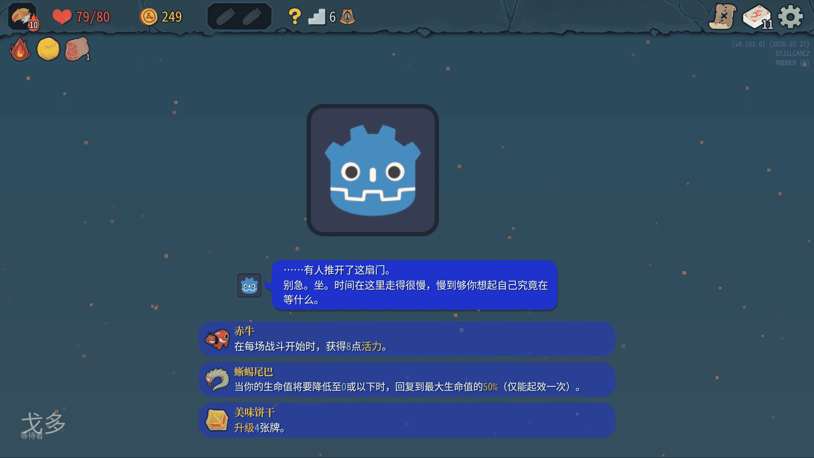

First, create the class:

```csharp
using Godot;
using MegaCrit.Sts2.Core.Events;
using MegaCrit.Sts2.Core.Models.Relics;
using MegaCrit.Sts2.Core.Runs;
using STS2RitsuLib.Interop.AutoRegistration;
using STS2RitsuLib.Scaffolding.Content;
using STS2RitsuLib.Utils;

namespace Test.Scripts;

[RegisterActAncient(typeof(Glory))] // Specify that this only generates in the Glory act
// [RegisterSharedAncient] // If you need custom generation conditions, register as shared and override isAllowed
public class TestAncient : ModAncientEventTemplate
{
    // Option button color
    public override Color ButtonColor => new(0.12f, 0.2f, 0.8f, 0.5f);
    // Dialogue box color
    public override Color DialogueColor => new(0.12f, 0.2f, 0.8f);

    // Custom scene path
    public override EventAssetProfile AssetProfile => new(
        BackgroundScenePath: "res://Test/scenes/test_ancient.tscn"
    );

    // For images, any format supported by Godot is fine — e.g. png, jpg, svg, etc.
    // Custom map icon and outline paths
    public override AncientEventPresentationAssetProfile AncientPresentationAssetProfile => new(
        MapIconPath: "res://icon.svg",
        MapIconOutlinePath: "res://icon.svg",
        RunHistoryIconPath: "res://icon.svg",
        RunHistoryIconOutlinePath: "res://icon.svg"
    );

    // Fixed pool 1 and 2
    private IReadOnlyList<EventOption> Pool1 => [
            CreateModRelicOption<Akabeko>(),
            CreateModRelicOption<Anchor>(),
        ];
    private IReadOnlyList<EventOption> Pool2 => [
            CreateModRelicOption<LizardTail>(),
            CreateModRelicOption<ArcaneScroll>(),
        ];

    // Weighted pool 3. Higher weight = more likely to generate. You can also write a custom list generation function.
    private WeightedList<EventOption> Pool3 => new()
    {
        { CreateModRelicOption<YummyCookie>(), 2 },
        { CreateModRelicOption<WingCharm>(), 1 }
    };

    // All possible options
    public override IEnumerable<EventOption> AllPossibleOptions => [.. Pool1, .. Pool2, .. Pool3];

    // Generate options
    protected override IReadOnlyList<EventOption> GenerateInitialOptions()
    {
        return
        [
            Rng.NextItem(Pool1)!,
            Rng.NextItem(Pool2)!,
            Pool3.GetRandom(Rng),
        ];
    }

    // Appearance condition. Here: only appears in the Overgrowth
    // public override bool IsValidForAct(ActModel act) {
    //     return act is Overgrowth;
    // }
}
```

Then create `{modId}/localization/{Language}/ancients.json`. If it already exists, just continue adding content.

The id here is `{modId}_ANCIENT_{UPPERCASE_SNAKE_CASE of the class name}`. For writing conventions, see the Ancient Dialogues chapter.

```json
{
  "TEST_ANCIENT_TEST_ANCIENT.title": "Godo",
  "TEST_ANCIENT_TEST_ANCIENT.epithet": "The Waiter",
  "TEST_ANCIENT_TEST_ANCIENT.talk.firstVisitEver.0-0.ancient": "...Someone pushed open this door.\nDon't rush. Sit. Time moves slowly here — slowly enough that you might remember what you've been waiting for.",
  "TEST_ANCIENT_TEST_ANCIENT.talk.ANY.0-0r.ancient": "No need to give your name. Too many people in line — names would trample each other.",
  "TEST_ANCIENT_TEST_ANCIENT.talk.ANY.1-0r.ancient": "You're back? The door isn't locked. I haven't left either. We're just... still here.",
  "TEST_ANCIENT_TEST_ANCIENT.talk.IRONCLAD.0-0.ancient": "Warrior, your flame burns too bright. Why don't you put it by the door first, then come in and wait?",
  "TEST_ANCIENT_TEST_ANCIENT.talk.IRONCLAD.1-0r.ancient": "You're still here. Good. Even anger can wait — once it tires, it will sit down.",
  "TEST_ANCIENT_TEST_ANCIENT.talk.IRONCLAD.2-0.ancient": "If you must go... take this. It's not a gift — it's proof that you'll come back next time.",
  "TEST_ANCIENT_TEST_ANCIENT.talk.IRONCLAD.2-0.next": "Continue",
  "TEST_ANCIENT_TEST_ANCIENT.talk.IRONCLAD.2-1.char": "...I'll take it. But I will still press on.",
  "TEST_ANCIENT_TEST_ANCIENT.talk.IRONCLAD.2-1.next": "Continue",
  "TEST_ANCIENT_TEST_ANCIENT.talk.IRONCLAD.2-2.ancient": "Good. The one thing those who hurry need most is knowing they'll return to some doorway.",
  "TEST_ANCIENT_TEST_ANCIENT.talk.SILENT.0-0.ancient": "Huntress, I won't ask where you came from. As long as you say nothing, we'll consider it settled.",
  "TEST_ANCIENT_TEST_ANCIENT.talk.SILENT.1-0r.ancient": "...Still here.",
  "TEST_ANCIENT_TEST_ANCIENT.talk.SILENT.2-0.ancient": "Silence is expensive. If you can afford it, I'll keep this chair for you.",
  "TEST_ANCIENT_TEST_ANCIENT.talk.SILENT.2-0.next": "Continue",
  "TEST_ANCIENT_TEST_ANCIENT.talk.SILENT.2-1.char": "......",
  "TEST_ANCIENT_TEST_ANCIENT.talk.SILENT.2-1.next": "Continue",
  "TEST_ANCIENT_TEST_ANCIENT.talk.SILENT.2-2.ancient": "Good. The loudest sound is often the one that says nothing.",
  "TEST_ANCIENT_TEST_ANCIENT.talk.DEFECT.0-0.ancient": "Construct... your ticking is steady. Like a clock. A clock understands waiting best.",
  "TEST_ANCIENT_TEST_ANCIENT.talk.DEFECT.1-0r.ancient": "<Steady beeping>",
  "TEST_ANCIENT_TEST_ANCIENT.talk.DEFECT.2-0.ancient": "If you're looking for the answer to \"being repaired\"... first learn to let the question hang. Hanging there, it won't shatter.",
  "TEST_ANCIENT_TEST_ANCIENT.talk.DEFECT.2-0.next": "Continue",
  "TEST_ANCIENT_TEST_ANCIENT.talk.DEFECT.2-1.char": "[i][font_size=22]<Hesitant beeping>[/font_size][/i]",
  "TEST_ANCIENT_TEST_ANCIENT.talk.DEFECT.2-1.next": "Continue",
  "TEST_ANCIENT_TEST_ANCIENT.talk.DEFECT.2-2.ancient": "Go. Take your rhythm with you — don't let it rush you. Let it wait beside you.",
  "TEST_ANCIENT_TEST_ANCIENT.talk.NECROBINDER.0-0.ancient": "Lady, even revenge waits in line. Would you like to take a number?",
  "TEST_ANCIENT_TEST_ANCIENT.talk.NECROBINDER.1-0r.ancient": "Your number hasn't been called yet. Don't rush. The longer hatred sits, the sharper the blade.",
  "TEST_ANCIENT_TEST_ANCIENT.talk.NECROBINDER.2-0.ancient": "If you must see blood... at least don't let it splatter on what hasn't arrived yet.",
  "TEST_ANCIENT_TEST_ANCIENT.talk.NECROBINDER.2-0.next": "Continue",
  "TEST_ANCIENT_TEST_ANCIENT.talk.NECROBINDER.2-1.char": "...I'll wait. Until the moment of reckoning comes.",
  "TEST_ANCIENT_TEST_ANCIENT.talk.NECROBINDER.2-1.next": "Continue",
  "TEST_ANCIENT_TEST_ANCIENT.talk.NECROBINDER.2-2.ancient": "That's right. Waiting is not weakness — it's sharpening the blade to strike only once.",
  "TEST_ANCIENT_TEST_ANCIENT.talk.REGENT.0-0.ancient": "Your Highness, the throne can wait — but tea tastes better after it cools a little.",
  "TEST_ANCIENT_TEST_ANCIENT.talk.REGENT.1-0r.ancient": "Welcome back, Your Highness. Today's wait is as costly as yesterday's — but you can afford it.",
  "TEST_ANCIENT_TEST_ANCIENT.talk.REGENT.2-0.ancient": "If you wish to command me... I have only one command in return: Sit. Wait.",
  "TEST_ANCIENT_TEST_ANCIENT.talk.REGENT.2-0.next": "Continue",
  "TEST_ANCIENT_TEST_ANCIENT.talk.REGENT.2-1.char": "...I can wait. But my subjects cannot wait too long!",
  "TEST_ANCIENT_TEST_ANCIENT.talk.REGENT.2-1.next": "Continue",
  "TEST_ANCIENT_TEST_ANCIENT.talk.REGENT.2-2.ancient": "Subjects wait for results, but the throne waits for timing. If you want both, you must learn to wait for both."
}
```



Scene example `test_ancient.tscn`:
```
[gd_scene load_steps=5 format=3 uid="uid://4i1v2d2h07n5"]

[ext_resource type="Texture2D" uid="uid://ddxmxgyyfy8mn" path="res://icon.svg" id="1_xjdov"]

[sub_resource type="Shader" id="Shader_8eo3w"]
code = "shader_type canvas_item;

group_uniforms Colors;
uniform vec4 color_a : source_color = vec4(0.18, 0.22, 0.38, 1.0);
uniform vec4 color_b : source_color = vec4(0.42, 0.28, 0.38, 1.0);
uniform vec4 color_c : source_color = vec4(0.12, 0.32, 0.36, 1.0);

group_uniforms Timing;
uniform float cycle_seconds : hint_range(4.0, 120.0, 0.5) = 22.0;
uniform float phase_offset : hint_range(0.0, 6.283, 0.01) = 1.57;

group_uniforms Layout;
uniform float vertical_mix : hint_range(0.0, 1.0, 0.01) = 0.22;

void fragment() {
	float t = TIME / max(cycle_seconds, 0.001);
	float w_ab = sin(t * TAU) * 0.5 + 0.5;
	float w_c = sin(t * TAU + phase_offset) * 0.5 + 0.5;
	vec3 rgb = mix(color_a.rgb, color_b.rgb, w_ab);
	rgb = mix(rgb, color_c.rgb, w_c);

	float v = clamp(UV.y, 0.0, 1.0);
	vec3 top_bias = mix(rgb, color_a.rgb, (1.0 - v) * vertical_mix);
	vec3 bot_bias = mix(top_bias, color_b.rgb, v * vertical_mix);
	rgb = bot_bias;

	vec4 tex = texture(TEXTURE, UV);
	vec4 out_c = vec4(rgb, color_a.a * tex.a) * tex * COLOR;
	COLOR = out_c;
}
"

[sub_resource type="ShaderMaterial" id="ShaderMaterial_n064g"]
shader = SubResource("Shader_8eo3w")
shader_parameter/color_a = Color(0.18, 0.22, 0.38, 1)
shader_parameter/color_b = Color(0.42, 0.28, 0.38, 1)
shader_parameter/color_c = Color(0.12, 0.32, 0.36, 1)
shader_parameter/cycle_seconds = 22.0
shader_parameter/phase_offset = 1.57
shader_parameter/vertical_mix = 0.22

[sub_resource type="Gradient" id="Gradient_wmiru"]
offsets = PackedFloat32Array(0, 0.258845, 1)
colors = PackedColorArray(0.847059, 0.803922, 0.301961, 0, 1, 1, 1, 1, 0.780392, 0.65098, 0.403922, 0)

[node name="TestAncient" type="Control"]
layout_mode = 3
anchors_preset = 15
anchor_right = 1.0
anchor_bottom = 1.0
grow_horizontal = 2
grow_vertical = 2
metadata/_edit_group_ = true
metadata/_edit_lock_ = true

[node name="TimeColorBackground" type="ColorRect" parent="."]
material = SubResource("ShaderMaterial_n064g")
layout_mode = 1
offset_left = -329.0
offset_top = -49.0
offset_right = 2253.0
offset_bottom = 1172.0

[node name="stars" type="CPUParticles2D" parent="."]
position = Vector2(925, 626)
scale = Vector2(1.01, 1.01)
amount = 300
lifetime = 3.0
preprocess = 5.0
local_coords = true
emission_shape = 3
emission_rect_extents = Vector2(1500, 1000)
gravity = Vector2(0, -10)
scale_amount_min = 5.0
scale_amount_max = 10.0
color = Color(0.878431, 0.498039, 0.392157, 0.611765)
color_ramp = SubResource("Gradient_wmiru")

[node name="TextureRect" type="TextureRect" parent="."]
layout_mode = 1
offset_left = 694.0
offset_top = 165.0
offset_right = 1044.0
offset_bottom = 515.0
texture = ExtResource("1_xjdov")

```
