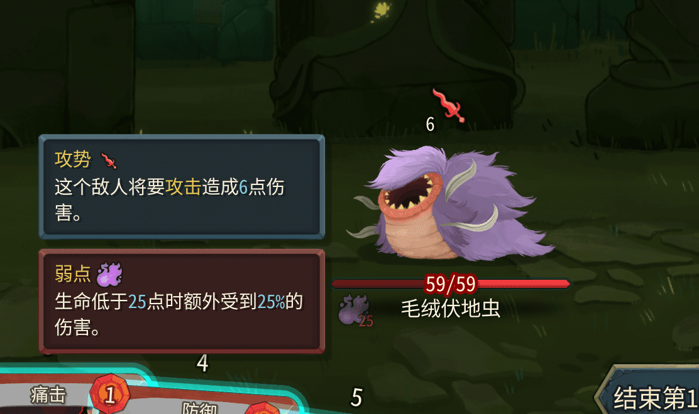

You can use this feature to create health bar overlays similar to `Poison` or `Doom`.



## Code

Add the `IHealthBarForecastSource` interface to your power class and override `GetHealthBarForecastSegments`:

```csharp
using Godot;
using MegaCrit.Sts2.Core.Entities.Creatures;
using MegaCrit.Sts2.Core.Entities.Powers;
using MegaCrit.Sts2.Core.Localization.DynamicVars;
using MegaCrit.Sts2.Core.Models;
using MegaCrit.Sts2.Core.ValueProps;
using STS2RitsuLib.Combat.HealthBars;
using STS2RitsuLib.Interop.AutoRegistration;
using STS2RitsuLib.Scaffolding.Content;

namespace Test.Scripts;

[RegisterPower]
// Implement the IHealthBarForecastSource interface to use this feature
public class TestPower2 : ModPowerTemplate, IHealthBarForecastSource
{
    public override PowerType Type => PowerType.Debuff;
    public override PowerStackType StackType => PowerStackType.Counter;

    public override PowerAssetProfile AssetProfile => new(
        IconPath: "res://RitsuTest/images/powers/test_power.png",
        BigIconPath: "res://RitsuTest/images/powers/test_power.png"
    );

    protected override IEnumerable<DynamicVar> CanonicalVars => [
        new DynamicVar("Weakness", 1.25m)
    ];

    public override decimal ModifyDamageMultiplicative(Creature? target, decimal amount, ValueProp props, Creature? dealer, CardModel? cardSource)
    {
        if (target != Owner || !props.IsPoweredAttack() || Owner.CurrentHp > Amount)
            return 1m;

        return DynamicVars["Weakness"].BaseValue;
    }

    // Implement the interface override
    public IEnumerable<HealthBarForecastSegment> GetHealthBarForecastSegments(HealthBarForecastContext context)
    {
        return HealthBarForecasts.Single(
            context.Creature.GetPowerAmount<TestPower2>(), // The amount to display (e.g. multiply by 2 if your power has a 2x effect)
            new Color(0.4f, 0.1f, 0.1f), // Color
            HealthBarForecastGrowthDirection.FromLeft // Extend from the left edge or the right edge
        // 0, // Order; larger values are farther from the health bar edge; default is 0
        // PreloadManager.Cache.GetMaterial("res://xxx.tres") // If a custom material is needed
        );
    }
}
```

Corresponding text in `powers.json`:

```json
{
    "TEST_POWER_TEST_POWER2.description": "Take extra damage when HP is below the threshold.",
    "TEST_POWER_TEST_POWER2.smartDescription": "Take [blue]{Weakness:percentMore()}%[/blue] more damage while HP is below [blue]{Amount}[/blue].",
    "TEST_POWER_TEST_POWER2.title": "Weakness"
}
```
