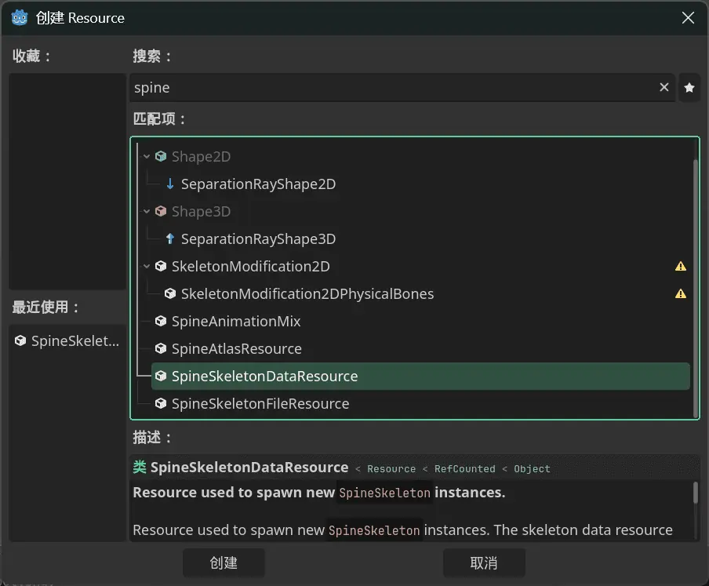
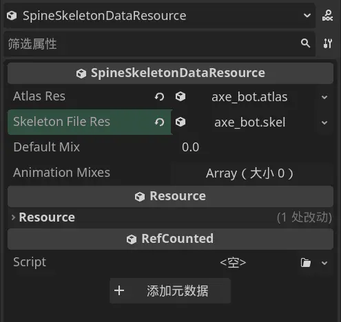
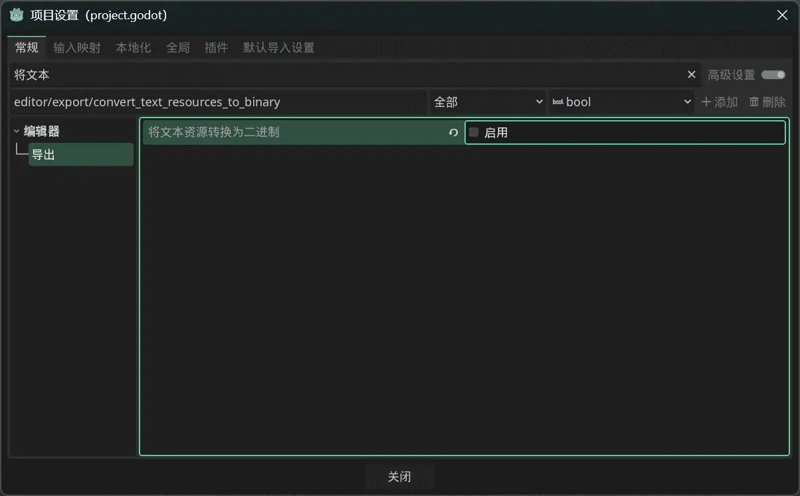

## Card Art Replacement

A simple approach is to directly patch, like this. This only replaces vanilla card art.

```csharp
    [HarmonyPatch(typeof(CardModel), nameof(CardModel.PortraitPath), MethodType.Getter)]
    public static class CardModel_GetPortrait_Patch
    {
        // Match class name to resource path
        private static readonly Dictionary<string, string> CustomPortraits = new(StringComparer.OrdinalIgnoreCase)
        {
            [nameof(StrikeIronclad)] = "res://test/images/image.png",
            [nameof(DefendIronclad)] = "res://test/images/image.png",
        };

        static void Postfix(CardModel __instance, ref string __result)
        {
            var className = __instance?.GetType().Name;
            if (string.IsNullOrEmpty(className)) return;
            if (!CustomPortraits.TryGetValue(className, out var path)) return;
            if (!ResourceLoader.Exists(path)) return;
            __result = path;
        }
    }
```

## Spine Import

Spire uses Spine version `4.2.43`. Versions below this cannot be used directly. (Converter: https://github.com/wang606/SpineSkeletonDataConverter)

* Step one: install the `Spine Godot Extension`. Refer to https://esotericsoftware.com/spine-godot . Place the files in your project root, then you may need to restart Godot.

* Put the exported atlas, skel, and png files from Spine into your project at a location of your choice. If you can see them in Godot's file system, you're good.

* Right-click in Godot's file system → create resource → create a `SpineSkeletonDataResource`. Set `Atlas Res` and `SkeletonFile Res` to the atlas and skel files respectively.

* Your combat character model needs these animation names: `idle_loop` (idle loop), `attack` (attack animation), `cast` (power card animation), `hurt` (taking damage), `die` (death).





* If you run into issues, open `Project → Project Settings` and disable `Convert Text Resources to Binary`.



~~Then you can reference this to replace characters: (this only replaces the combat character without playing the initial animation, for reference only)~~ The old code had too few features. Removed to avoid misleading newcomers.

## Arbitrary Model Replacement

* Just patch `CharacterModel.CreateVisuals` to return your own node inheriting from `NCreatureVisuals`, and you can replace characters with any scene.
* ~~Create a class inheriting `NCreatureVisuals` and attach it to your new `Node2D` scene.~~ Refer to the `Custom Character Background` section in `Adding Characters`. No scripts needed anymore.
* The scene needs uniquely named (`%`) nodes: `Visuals(Node2D)`, `Bounds(Control)`, `IntentPos(Marker2D)`, `CenterPos(Marker2D)`.
* For 3D models, create a hierarchy of `subviewportcontainer → subviewport`, then add `camera3d` and any 3D models inside `subviewport`. Adjust the camera in the 3D view until it looks correct in 2D. Set `subviewport`'s `transparent` to `true`.
