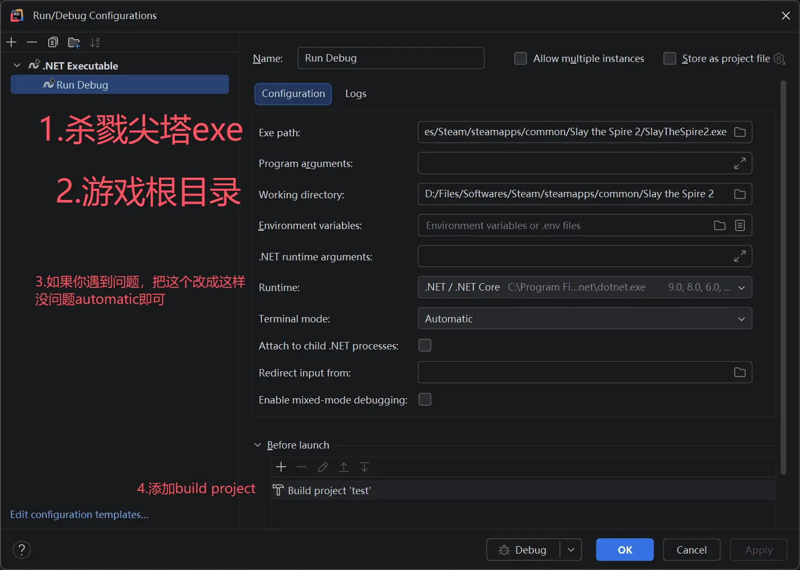

## VSCode

Add the following to your `csproj`:

```xml
  <!-- Other content omitted -->
    <Sts2DataDir>$(Sts2Dir)/data_sts2_windows_x86_64</Sts2DataDir>
  </PropertyGroup>

  <!-- New -->
  <PropertyGroup Condition="'$(Configuration)' == 'Debug'">
    <Optimize>false</Optimize>
    <DebugType>portable</DebugType>
  </PropertyGroup>
  <PropertyGroup Condition="'$(Configuration)' == 'Release'">
    <Optimize>true</Optimize>
    <DebugType>none</DebugType>
    <PathMap>$(AppOutputBase)=.\</PathMap>
  </PropertyGroup>

  <ItemGroup>
    <Reference Include="sts2">
      <HintPath>$(Sts2DataDir)/sts2.dll</HintPath>
      <Private>false</Private>
    </Reference>
  <!-- Other content omitted -->

  <Target Name="Copy Mod" AfterTargets="PostBuildEvent">
    <Message Text="Copying mod to Slay the Spire 2 mods folder..." Importance="high"/>
    <MakeDir Directories="$(Sts2Dir)/mods/"/>
    <Copy SourceFiles="$(TargetPath)" DestinationFolder="$(Sts2Dir)/mods/$(MSBuildProjectName)/"/>
    <!-- New -->
    <Copy SourceFiles="$(TargetDir)$(TargetName).pdb"
              DestinationFolder="$(Sts2Dir)/mods/$(MSBuildProjectName)/"
              Condition="Exists('$(TargetDir)$(TargetName).pdb')" />
    <Copy SourceFiles="$(MSBuildProjectName).json" DestinationFolder="$(Sts2Dir)/mods/$(MSBuildProjectName)/"/>
    </Target>
```

Create a `.vscode` folder in the project root.

* Add a `launch.json` file:

```json
{
  "version": "0.2.0",
  "configurations": [
    {
      "name": "Run Debug",
      "type": "coreclr",
      "request": "launch",
      "preLaunchTask": "build",
      "program": "${config:sts2.installDir}/${config:sts2.gameExeName}",
      "cwd": "${config:sts2.installDir}",
      "console": "internalConsole",
      "sourceFileMap": {
        ".\\": "${workspaceFolder}/"
      },
      "stopAtEntry": false
    }
  ]
}
```

* Add a `tasks.json` file:

```json
{
  "version": "2.0.0",
  "tasks": [
    {
      "label": "build",
      "type": "process",
      "command": "dotnet",
      "args": [
        "build",
        "${workspaceFolder}/${config:sts2.modId}.csproj",
        "-c",
        "Debug",
        "--nologo"
      ],
      "group": "build",
      "problemMatcher": "$msCompile"
    }
  ]
}
```

* Add a `settings.json` file (change the paths and names to yours):

```json
{
    "sts2.installDir": "D:/Steam/steamapps/common/Slay the Spire 2",
    "sts2.gameExeName": "SlayTheSpire2.exe",
    "sts2.modId": "test"
}
```

* Open VSCode settings (`ctrl+,`), search for `Csharp › Experimental › Debug: Hot Reload` and enable it.

* Press F5 to start.

* When you modify code, click the flame icon (🔥) in the debug toolbar to apply hot reload. <b>Hot reload is limited — no adding or removing functions or other major changes.</b>

* Resource PCK files can't be hot-reloaded this way.

* If the game refuses to launch without Steam, create a `steam_appid.txt` in the root directory with `2868840` inside.

* You can also set breakpoints. Click the left margin next to a line of code (the red dot).

## Rider

Add the following to your `csproj`:

```xml
  <!-- Other content omitted -->
    <Sts2DataDir>$(Sts2Dir)/data_sts2_windows_x86_64</Sts2DataDir>
  </PropertyGroup>

  <!-- New -->
  <PropertyGroup Condition="'$(Configuration)' == 'Debug'">
    <Optimize>false</Optimize>
    <DebugType>portable</DebugType>
  </PropertyGroup>
  <PropertyGroup Condition="'$(Configuration)' == 'Release'">
    <Optimize>true</Optimize>
    <DebugType>none</DebugType>
    <PathMap>$(AppOutputBase)=.\</PathMap>
  </PropertyGroup>

  <ItemGroup>
    <Reference Include="sts2">
      <HintPath>$(Sts2DataDir)/sts2.dll</HintPath>
      <Private>false</Private>
    </Reference>
  <!-- Other content omitted -->

  <Target Name="Copy Mod" AfterTargets="PostBuildEvent">
    <Message Text="Copying mod to Slay the Spire 2 mods folder..." Importance="high"/>
    <MakeDir Directories="$(Sts2Dir)/mods/"/>
    <Copy SourceFiles="$(TargetPath)" DestinationFolder="$(Sts2Dir)/mods/$(MSBuildProjectName)/"/>
    <!-- New -->
    <Copy SourceFiles="$(TargetDir)$(TargetName).pdb"
              DestinationFolder="$(Sts2Dir)/mods/$(MSBuildProjectName)/"
              Condition="Exists('$(TargetDir)$(TargetName).pdb')" />
    <Copy SourceFiles="$(MSBuildProjectName).json" DestinationFolder="$(Sts2Dir)/mods/$(MSBuildProjectName)/"/>
    </Target>
```

Click `Add Configuration` in the top right, then `Edit Configuration`, and create a `.NET Executable` configuration with the following setup.



* Start in `Debug` mode. (Don't click the green triangle to run directly.)

* When you modify code, click the flame icon (🔥) in the debug toolbar, or in older versions click `Apply Changes` at the top, to apply hot reload. <b>Hot reload is limited — no adding or removing functions or other major changes.</b>

* Resource PCK files can't be hot-reloaded this way.

* If the game refuses to launch without Steam, create a `steam_appid.txt` in the root directory with `2868840` inside.

* You can also set breakpoints. Click the left margin next to a line of code.
