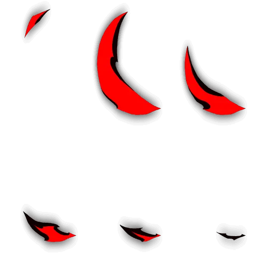
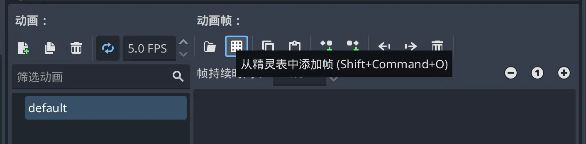
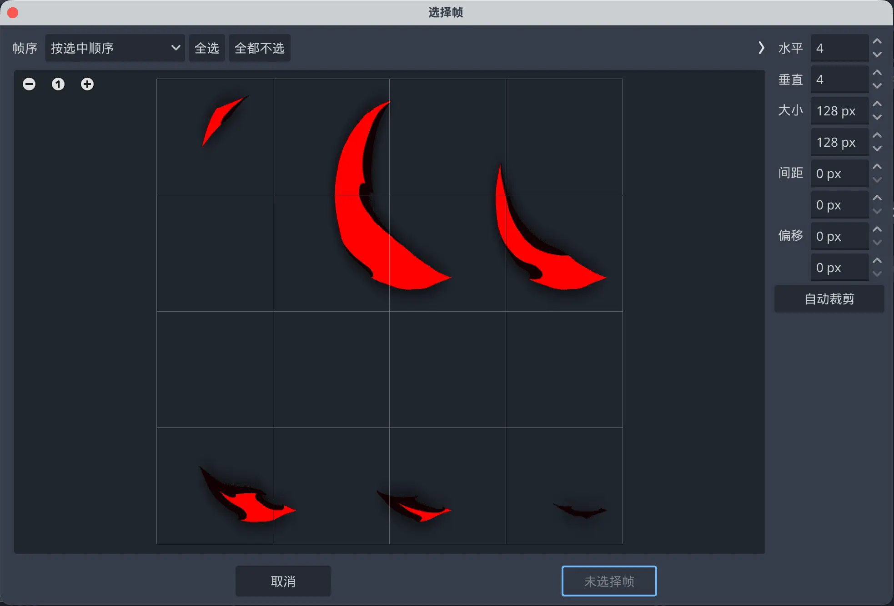
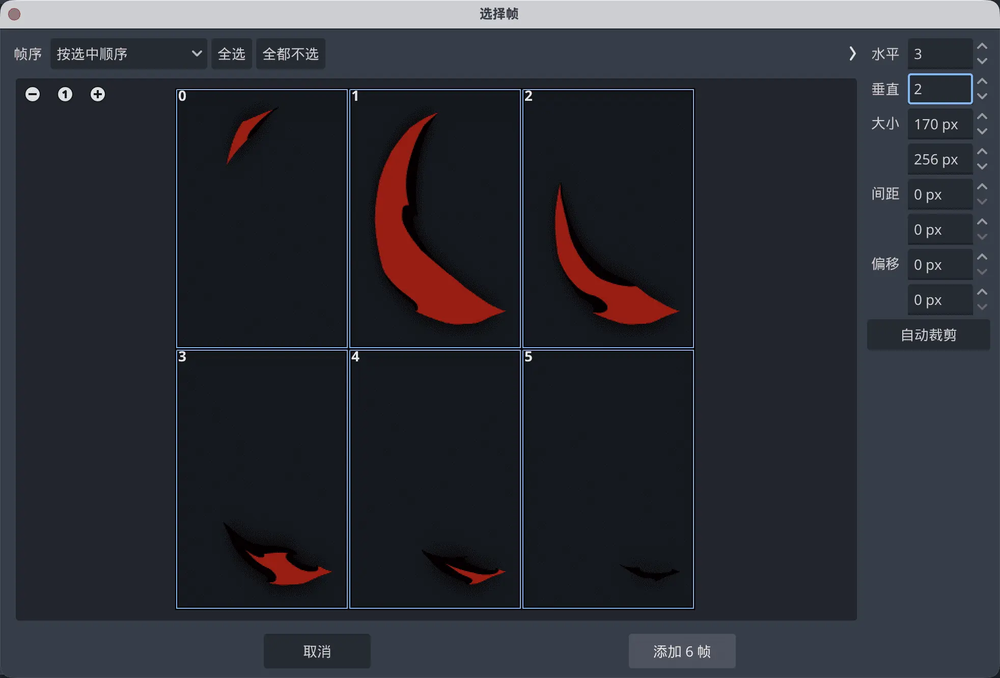

## Texture Atlas

A texture atlas (also called a sprite sheet or material sheet) is when your assets are not multiple separate images, but a single image containing all parts arranged in a rectangular grid.

For example, the vanilla slash effect (vfx_slash):

The advantage of texture atlases is relatively good performance and small file size, but they aren't suitable for large-scale effects.

### 1. Import the Sprite Sheet
The process is nearly identical to frame animation, except at the import step. Click "Add Frames from Sprite Sheet" and import the image you prepared.

### 2. Load the Atlas and Auto-Slice

The atlas now appears in the preview area. We need to turn it into individual animation frames.

Horizontal count: how many frames per row in the atlas.

Vertical count: how many rows in the atlas.

Check "Trim" to auto-remove blank edges.

For this image, select Horizontal: 3, Vertical: 2, and click through 6 times to select each frame, then add.

