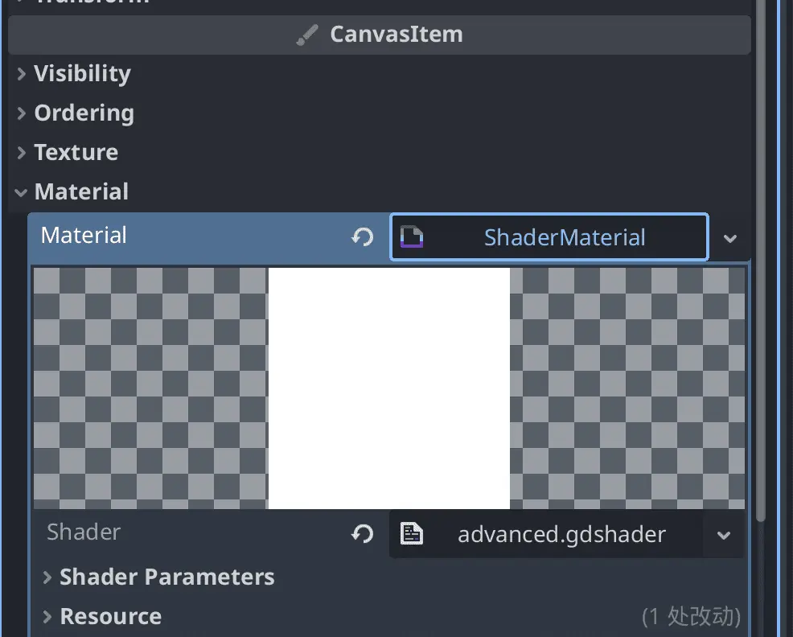
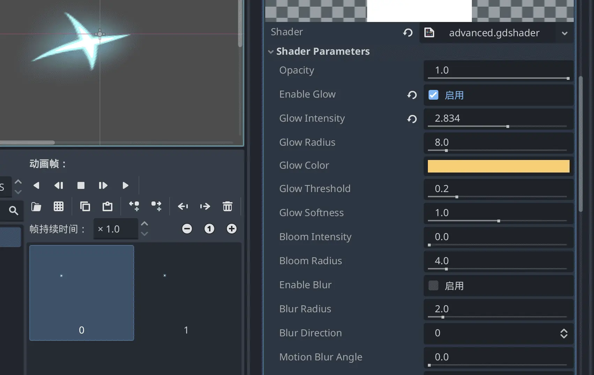
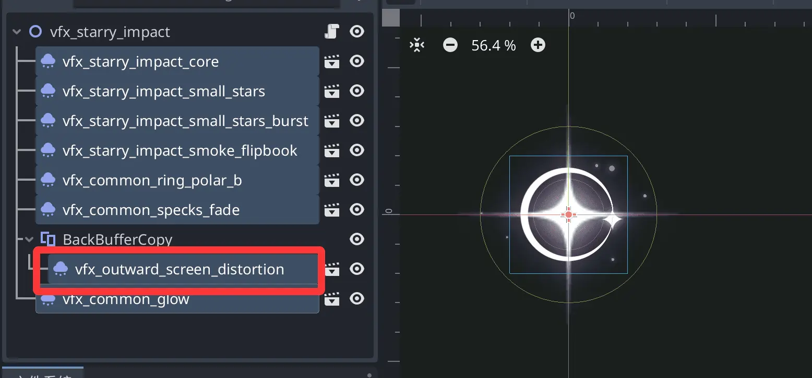
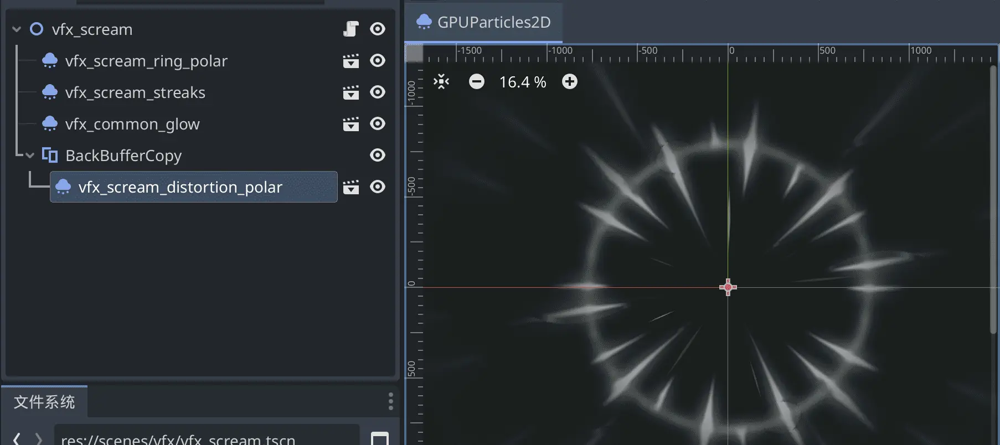

## Shaders

Shaders are part of advanced VFX. We use them in many places.

- Dynamic color grading & stylization: recolor without modifying the source image — flash red on damage, freeze blue, poison green, etc.
- Texture blending & procedural details: blend multiple textures via masks, or generate dynamic textures through noise algorithms (fire, water, clouds).
- Outlines, glow & edge light: based on normals or depth info, add outer glow, rim light, or comic-style outlines to assets.
- UV animation & deformation: offset texture coordinates for flowing water, scrolling backgrounds, or distort vertices for waving, breathing effects.

Here are a few concrete examples.

### 1. Enhancing Existing VFX/Animation with Shaders

Sometimes you've already built an effect using frame animation or particles, but it doesn't look bright enough, the colors feel off, or the impact/motion isn't there.

Or you want to make a slime character and need several color variants — glowing, distorted, etc.

In these cases, add a shader to the effect's material and tweak its parameters.

Here's a universal shader. Save it as `advanced.gdshader`.

```shaderlab
shader_type canvas_item;

// =============================================
// Advanced Image Filter - Photoshop / Animate / CSS3 Filter Collection
// =============================================

// === Basic ===
// Global opacity
uniform float opacity : hint_range(0.0, 1.0) = 1.0;

// === Glow & Bloom ===
// Enable glow
uniform bool enable_glow = false;
// Glow intensity
uniform float glow_intensity : hint_range(0.0, 5.0) = 1.0;
// Glow radius (pixels)
uniform float glow_radius : hint_range(0.0, 64.0) = 8.0;
// Glow color
uniform vec4 glow_color : source_color = vec4(1.0, 0.8, 0.4, 1.0);
// Glow threshold (luminance below this doesn't glow)
uniform float glow_threshold : hint_range(0.0, 1.0) = 0.2;
// Glow softness
uniform float glow_softness : hint_range(0.0, 2.0) = 1.0;
// Bloom - spread bright areas outward
uniform float bloom_intensity : hint_range(0.0, 3.0) = 0.0;
uniform float bloom_radius : hint_range(0.0, 32.0) = 4.0;

// === Blur ===
// Enable blur
uniform bool enable_blur = false;
// Blur radius
uniform float blur_radius : hint_range(0.0, 20.0) = 2.0;
// Gaussian blur direction (0=bidirectional, 1=horizontal, 2=vertical)
uniform int blur_direction : hint_range(0, 2) = 0;
// Motion blur angle
uniform float motion_blur_angle : hint_range(0.0, 360.0) = 0.0;
// Motion blur distance
uniform float motion_blur_distance : hint_range(0.0, 20.0) = 0.0;

// === Sharpen ===
uniform bool enable_sharpen = false;
uniform float sharpen_amount : hint_range(0.0, 3.0) = 1.0;
uniform float sharpen_radius : hint_range(0.5, 3.0) = 1.0;

// === Distortion ===
// Enable distortion
uniform bool enable_distortion = false;
// Ripple intensity
uniform float ripple_intensity : hint_range(0.0, 0.1) = 0.0;
// Ripple frequency
uniform float ripple_frequency : hint_range(0.0, 50.0) = 10.0;
// Ripple speed
uniform float ripple_speed : hint_range(-10.0, 10.0) = 1.0;
// Swirl intensity
uniform float swirl_intensity : hint_range(0.0, 2.0) = 0.0;
// Swirl center offset
uniform vec2 swirl_center = vec2(0.5, 0.5);
// Lens distortion (fisheye/barrel)
uniform float lens_distort : hint_range(-1.0, 1.0) = 0.0;
// Chromatic aberration (RGB separation)
uniform float chromatic_aberration : hint_range(0.0, 0.05) = 0.0;

// === Color Adjustment ===
// Hue rotation (degrees)
uniform float hue_shift : hint_range(-180.0, 180.0) = 0.0;
// Saturation
uniform float saturation : hint_range(0.0, 2.0) = 1.0;
// Brightness
uniform float brightness : hint_range(-1.0, 1.0) = 0.0;
// Contrast
uniform float contrast : hint_range(0.0, 2.0) = 1.0;
// Color Overlay
uniform bool enable_color_overlay = false;
uniform vec4 overlay_color : source_color = vec4(1.0, 0.0, 0.0, 0.5);
uniform int overlay_blend_mode : hint_range(0, 5) = 0; // 0=Normal,1=Multiply,2=Screen,3=Overlay,4=SoftLight,5=ColorBurn
// Gradient map
uniform bool enable_gradient_map = false;
uniform vec4 gradient_color1 : source_color = vec4(0.0, 0.0, 0.0, 1.0);
uniform vec4 gradient_color2 : source_color = vec4(1.0, 1.0, 1.0, 1.0);

// === Special Effects ===
// Outline / edge detection
uniform bool enable_outline = false;
uniform float outline_width : hint_range(0.0, 8.0) = 2.0;
uniform vec4 outline_color : source_color = vec4(0.0, 0.0, 0.0, 1.0);
// Pixelation
uniform float pixelate_size : hint_range(0.0, 64.0) = 0.0;
// Invert
uniform bool invert_colors = false;
// Grayscale
uniform bool grayscale = false;
// Sepia
uniform bool sepia = false;
// Threshold / binary
uniform float threshold_level : hint_range(0.0, 1.0) = 0.0;

// =============================================
// Utility Functions
// =============================================

// RGB -> HSV
vec3 rgb2hsv(vec3 c) {
    vec4 K = vec4(0.0, -1.0 / 3.0, 2.0 / 3.0, -1.0);
    vec4 p = mix(vec4(c.bg, K.wz), vec4(c.gb, K.xy), step(c.b, c.g));
    vec4 q = mix(vec4(p.xyw, c.r), vec4(c.r, p.yzx), step(p.x, c.r));
    float d = q.x - min(q.w, q.y);
    float e = 1.0e-10;
    return vec3(abs(q.z + (q.w - q.y) / (6.0 * d + e)), d / (q.x + e), q.x);
}

// HSV -> RGB
vec3 hsv2rgb(vec3 c) {
    vec4 K = vec4(1.0, 2.0 / 3.0, 1.0 / 3.0, 3.0);
    vec3 p = abs(fract(c.xxx + K.xyz) * 6.0 - K.www);
    return c.z * mix(K.xxx, clamp(p - K.xxx, 0.0, 1.0), c.y);
}

// Blend modes
vec3 blend(vec3 base, vec3 blend, int mode) {
    if (mode == 1) return base * blend; // Multiply
    if (mode == 2) return 1.0 - (1.0 - base) * (1.0 - blend); // Screen
    if (mode == 3) {
        // Overlay
        return mix(2.0 * base * blend, 1.0 - 2.0 * (1.0 - base) * (1.0 - blend), step(0.5, base));
    }
    if (mode == 4) {
        // Soft Light
        return mix(2.0 * base * blend + base * base * (1.0 - 2.0 * blend), 
                   sqrt(base) * (2.0 * blend - 1.0) + 2.0 * base * (1.0 - blend), 
                   step(0.5, blend));
    }
    if (mode == 5) return 1.0 - (1.0 - blend) / (base + 0.001); // Color Burn
    return blend; // Normal
}

// High-quality Gaussian blur
vec4 gaussian_blur(sampler2D tex, vec2 uv, vec2 pixel_size, float radius, int direction) {
    if (radius <= 0.0) return texture(tex, uv);
    
    vec4 color = vec4(0.0);
    float total_weight = 0.0;
    
    int samples = int(min(radius * 2.0 + 1.0, 32.0));
    
    for (int i = -samples; i <= samples; i++) {
        float fi = float(i);
        float weight = exp(-(fi * fi) / (2.0 * radius * radius + 0.001));
        
        vec2 offset = vec2(0.0);
        if (direction == 0 || direction == 1) offset.x = fi * pixel_size.x;
        if (direction == 0 || direction == 2) offset.y = fi * pixel_size.y;
        
        color += texture(tex, uv + offset) * weight;
        total_weight += weight;
    }
    
    return color / total_weight;
}

// Bidirectional Gaussian blur
vec4 gaussian_blur_2d(sampler2D tex, vec2 uv, vec2 pixel_size, float radius) {
    if (radius <= 0.0) return texture(tex, uv);
    
    // Two-pass: horizontal then vertical
    vec4 horizontal = vec4(0.0);
    float total_weight = 0.0;
    int samples = int(min(radius * 2.0 + 1.0, 32.0));
    
    for (int i = -samples; i <= samples; i++) {
        float fi = float(i);
        float weight = exp(-(fi * fi) / (2.0 * radius * radius + 0.001));
        horizontal += texture(tex, uv + vec2(fi * pixel_size.x, 0.0)) * weight;
        total_weight += weight;
    }
    horizontal /= total_weight;
    
    vec4 vertical = vec4(0.0);
    total_weight = 0.0;
    for (int i = -samples; i <= samples; i++) {
        float fi = float(i);
        float weight = exp(-(fi * fi) / (2.0 * radius * radius + 0.001));
        vertical += texture(tex, uv + vec2(0.0, fi * pixel_size.y)) * weight;
        total_weight += weight;
    }
    vertical /= total_weight;
    
    return (horizontal + vertical) * 0.5;
}

// Motion blur
vec4 motion_blur(sampler2D tex, vec2 uv, vec2 pixel_size, float distance, float angle_deg) {
    if (distance <= 0.0) return texture(tex, uv);
    
    float angle = radians(angle_deg);
    vec2 dir = vec2(cos(angle), sin(angle)) * pixel_size * distance;
    
    vec4 color = vec4(0.0);
    int samples = 16;
    for (int i = 0; i < samples; i++) {
        float t = float(i) / float(samples - 1);
        color += texture(tex, uv + dir * (t - 0.5));
    }
    return color / float(samples);
}

// Multi-sample glow
vec4 get_glow(sampler2D tex, vec2 uv, vec2 pixel_size, float radius, float threshold, float intensity, vec4 glow_col, float softness) {
    if (radius <= 0.0 || intensity <= 0.0) return vec4(0.0);
    
    vec4 glow = vec4(0.0);
    float total_weight = 0.0;
    int samples = int(min(radius * 1.5 + 4.0, 24.0));
    
    for (int x = -samples; x <= samples; x++) {
        for (int y = -samples; y <= samples; y++) {
            if (x == 0 && y == 0) continue;
            vec2 offset = vec2(float(x), float(y)) * pixel_size * radius;
            vec4 sample_col = texture(tex, uv + offset);
            
            float lum = dot(sample_col.rgb, vec3(0.299, 0.587, 0.114));
            float mask = smoothstep(threshold, threshold + 0.1 + softness * 0.2, lum);
            
            float dist = length(vec2(float(x), float(y)));
            float weight = exp(-dist / (radius * 0.5 + 0.1));
            
            glow += sample_col * mask * weight;
            total_weight += weight;
        }
    }
    
    glow = glow / total_weight * intensity;
    return glow * glow_col;
}

// Sharpen
vec4 sharpen(sampler2D tex, vec2 uv, vec2 pixel_size, float amount, float radius) {
    vec4 center = texture(tex, uv);
    vec4 blurred = gaussian_blur_2d(tex, uv, pixel_size, radius);
    return center + (center - blurred) * amount;
}

// Edge detection / outline
vec4 outline(sampler2D tex, vec2 uv, vec2 pixel_size, float width, vec4 line_color) {
    float alpha = 0.0;
    int steps = 8;
    for (int i = 0; i < steps; i++) {
        float angle = float(i) / float(steps) * 6.28318;
        vec2 offset = vec2(cos(angle), sin(angle)) * pixel_size * width;
        alpha = max(alpha, texture(tex, uv + offset).a);
    }
    
    float center_alpha = texture(tex, uv).a;
    alpha = alpha * (1.0 - center_alpha);
    
    return vec4(line_color.rgb, alpha * line_color.a);
}

// Distort UV
vec2 distort_uv(vec2 uv) {
    vec2 distorted = uv;
    
    // Pixelate
    if (pixelate_size > 0.0) {
        distorted = floor(distorted * pixelate_size) / pixelate_size;
    }
    
    // Swirl
    if (swirl_intensity > 0.0) {
        vec2 center = swirl_center;
        vec2 delta = distorted - center;
        float dist = length(delta);
        float angle = atan(delta.y, delta.x);
        float swirl = swirl_intensity * (1.0 - dist) * 3.14159;
        angle += swirl * smoothstep(1.0, 0.0, dist * 2.0);
        distorted = center + vec2(cos(angle), sin(angle)) * dist;
    }
    
    // Ripple
    if (ripple_intensity > 0.0) {
        float ripple = sin(distorted.x * ripple_frequency + TIME * ripple_speed) 
                     * cos(distorted.y * ripple_frequency + TIME * ripple_speed);
        distorted += vec2(cos(ripple * 3.14159), sin(ripple * 3.14159)) * ripple_intensity;
    }
    
    // Lens distortion
    if (lens_distort != 0.0) {
        vec2 center = vec2(0.5, 0.5);
        vec2 delta = distorted - center;
        float dist = length(delta);
        float factor = 1.0 + lens_distort * dist * dist;
        distorted = center + delta * factor;
    }
    
    return distorted;
}

// Color adjustment
vec3 adjust_color(vec3 color) {
    // HSV adjustments
    vec3 hsv = rgb2hsv(color);
    hsv.x += hue_shift / 360.0;
    hsv.x = fract(hsv.x);
    hsv.y *= saturation;
    hsv.z += brightness;
    color = hsv2rgb(hsv);
    
    // Contrast
    color = (color - 0.5) * contrast + 0.5;
    
    // Invert
    if (invert_colors) color = 1.0 - color;
    
    // Grayscale
    if (grayscale) {
        float lum = dot(color, vec3(0.299, 0.587, 0.114));
        color = vec3(lum);
    }
    
    // Sepia
    if (sepia) {
        color = vec3(
            dot(color, vec3(0.393, 0.769, 0.189)),
            dot(color, vec3(0.349, 0.686, 0.168)),
            dot(color, vec3(0.272, 0.534, 0.131))
        );
    }
    
    // Threshold
    if (threshold_level > 0.0) {
        float lum = dot(color, vec3(0.299, 0.587, 0.114));
        color = vec3(step(threshold_level, lum));
    }
    
    // Gradient map
    if (enable_gradient_map) {
        float lum = dot(clamp(color, 0.0, 1.0), vec3(0.299, 0.587, 0.114));
        color = mix(gradient_color1.rgb, gradient_color2.rgb, lum);
    }
    
    return color;
}

// =============================================
// Main
// =============================================

void fragment() {
    vec2 pixel_size = TEXTURE_PIXEL_SIZE;
    vec2 uv = UV;
    
    // 1. Distort UV
    vec2 distorted_uv = distort_uv(uv);
    
    // 2. Chromatic aberration sampling
    vec4 tex_color;
    if (chromatic_aberration > 0.0 && enable_distortion) {
        float r = texture(TEXTURE, distorted_uv + vec2(chromatic_aberration, 0.0)).r;
        float g = texture(TEXTURE, distorted_uv).g;
        float b = texture(TEXTURE, distorted_uv - vec2(chromatic_aberration, 0.0)).b;
        float a = texture(TEXTURE, distorted_uv).a;
        tex_color = vec4(r, g, b, a);
    } else {
        tex_color = texture(TEXTURE, distorted_uv);
    }
    
    // 3. Glow
    vec4 glow = vec4(0.0);
    if (enable_glow) {
        glow = get_glow(TEXTURE, distorted_uv, pixel_size, glow_radius, glow_threshold, glow_intensity, glow_color, glow_softness);
    }
    
    // 4. Bloom
    vec4 bloom = vec4(0.0);
    if (bloom_intensity > 0.0) {
        bloom = get_glow(TEXTURE, distorted_uv, pixel_size, bloom_radius, 0.3, bloom_intensity, vec4(1.0), 0.5);
    }
    
    // 5. Blur
    vec4 blur = vec4(0.0);
    if (enable_blur) {
        if (motion_blur_distance > 0.0) {
            blur = motion_blur(TEXTURE, distorted_uv, pixel_size, motion_blur_distance, motion_blur_angle);
        } else if (blur_direction == 0) {
            blur = gaussian_blur_2d(TEXTURE, distorted_uv, pixel_size, blur_radius);
        } else {
            blur = gaussian_blur(TEXTURE, distorted_uv, pixel_size, blur_radius, blur_direction);
        }
    }
    
    // 6. Sharpen
    vec4 sharpened = vec4(0.0);
    if (enable_sharpen) {
        sharpened = sharpen(TEXTURE, distorted_uv, pixel_size, sharpen_amount, sharpen_radius);
    }
    
    // Composite base color
    vec4 base_color = tex_color;
    if (enable_blur) base_color = mix(base_color, blur, 0.8);
    if (enable_sharpen) base_color = sharpened;
    
    // 7. Color adjustment
    base_color.rgb = adjust_color(base_color.rgb);
    
    // 8. Color overlay
    if (enable_color_overlay) {
        base_color.rgb = blend(base_color.rgb, overlay_color.rgb, overlay_blend_mode);
        base_color.a *= overlay_color.a;
    }
    
    // 9. Outline
    vec4 outline_col = vec4(0.0);
    if (enable_outline) {
        outline_col = outline(TEXTURE, distorted_uv, pixel_size, outline_width, outline_color);
    }
    
    // Final composite
    vec3 final_rgb = base_color.rgb + glow.rgb + bloom.rgb;
    float final_alpha = max(base_color.a, outline_col.a);
    
    // Outline blending
    if (outline_col.a > 0.0) {
        final_rgb = mix(final_rgb, outline_col.rgb, outline_col.a);
    }
    
    // Apply opacity
    final_alpha *= opacity;
    
    COLOR = vec4(final_rgb, final_alpha);
}

```

For the node you want to apply the shader to (e.g. SpriteAnimation2D, Sprite2D, etc.), click CanvasItem - Material, create a new ShaderMaterial, then quickly load the shader.



Then click the shader to adjust various parameters in the panel below.

Includes glow, exposure, blur, motion blur, sharpen, distortion, hue, outline, swirl, ripple, chromatic aberration (RGB separation), and other common post-processing effects.



### 2. Area Effects

Look at the Regent's attack hit effect `starry_impact` and `scream` from the vanilla game:


Notice that the `vfx_distortion`-related effects are screen distortion effects — they appear as a distorted area on screen.

Shaders are pure code, which makes them AI-friendly. To replicate a similar effect, just extract the gdshader source, feed it to AI, and have it implement what you need.
